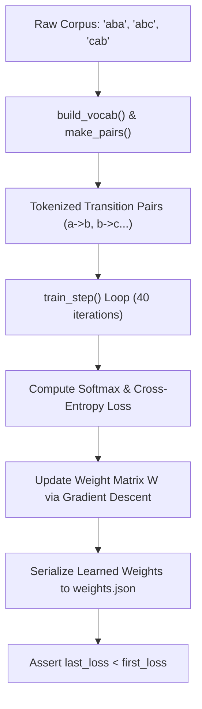

# Lab 0: Foundational Next-Token Model Pretraining from Scratch

In this lab, you will implement a pure-Python character-level training loop `train()` that tokenizes sample text strings, computes next-token logits and softmax cross-entropy loss, and serializes trained weight parameters to disk (`weights.json`).

---

## What you touch
- Script to create: `lab0_pretrain_tiny.py`
- Target Output: `weights.json`
- Training Texts: `"aba"`, `"abc"`, `"cab"`
- Main Functions:
  - `build_vocab(texts: list[str]) -> tuple[dict, dict]`
  - `make_pairs(texts: list[str], stoi: dict) -> list[tuple[int, int]]`
  - `softmax(logits: list[float]) -> list[float]`
  - `train_step(W: list[list[float]], pairs: list[tuple[int, int]], lr: float) -> float`
  - `train(texts: list[str], steps: int, lr: float) -> dict`
- Hyperparameters: `steps = 40`, `lr = 0.5`
- Pure Python standard library (no torch or transformers required)

---

## Steps


1. Implement `build_vocab(texts)`: Extract unique characters, building `stoi` (char $\rightarrow$ int) and `itos` (int $\rightarrow$ char).
2. Implement `make_pairs(texts, stoi)`: Generate sequential `(token_i, token_{i+1})` training index pairs.
3. Implement `softmax(logits)`: Calculate normalized exponential probability distributions.
4. Implement `train_step(W, pairs, lr)`: Compute cross-entropy loss and update weights using gradient descent.
5. Implement `train(texts, steps, lr)`: Initialize zero weight matrix $W$ ($V \times V$), run optimization steps, track `first_loss` and `last_loss`, and write `weights.json`.
6. In `__main__`: Execute training and assert that `last_loss` is strictly less than `first_loss`.

---

## Data contract

**Training Metrics Output**

```json
{
  "first_loss": 1.098612,
  "last_loss": 0.384512
}
```

**Serialized Weights (`weights.json`)**

```json
{
  "stoi": { "a": 0, "b": 1, "c": 2 },
  "W": [
    [-0.45, 0.92, -0.47],
    [-0.12, -0.34, 0.46],
    [0.85, -0.41, -0.44]
  ]
}
```

---

## Run
From the repository root, run:

```bash
python education/optional_training/lab0_pretrain_tiny.py
```

```powershell
python education/optional_training/lab0_pretrain_tiny.py
```

---

## What you should see
- `=== STARTING PURE PYTHON TINY PRETRAINING LOOP ===`
- `Initial Loss (first_loss): ~1.0986`
- `Final Loss (last_loss): < 0.5000`
- `Weights saved successfully to weights.json`

---

## Stop here
You have successfully pretrained a tiny language model from scratch! In Lab 1, we will explore parameter-efficient fine-tuning with LoRA.

Next up: [Lab 1: LoRA / QLoRA](./lab1_lora_qlora.md).

---

## Notes
*(Record your initial and final pretraining loss values here)*

