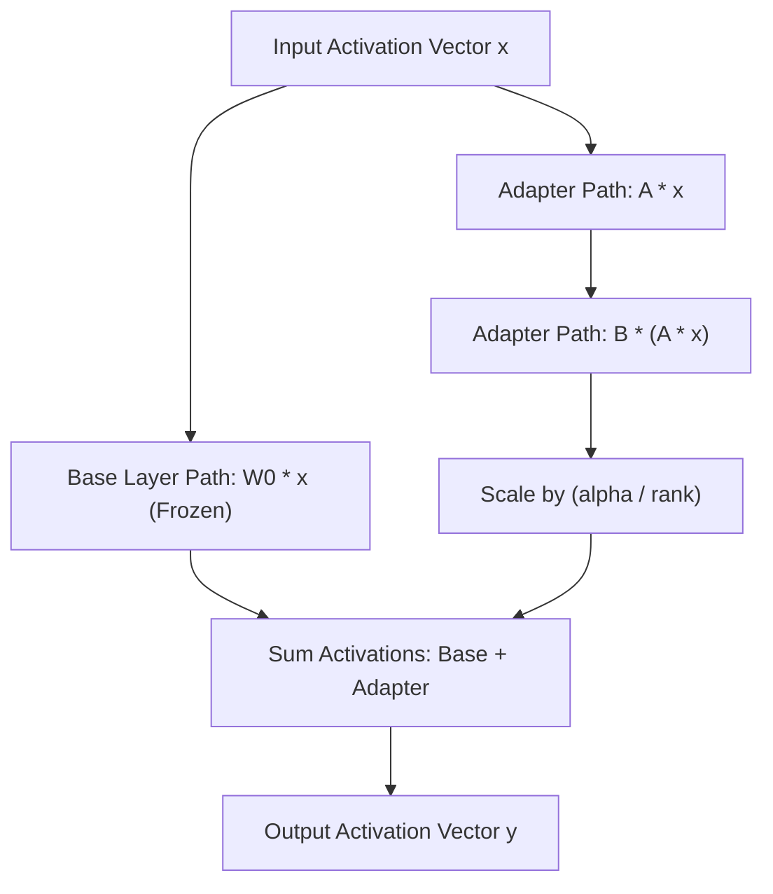

# Lab 1: Low-Rank Adaptation (LoRA) Layer & Parameter Budget Calculator

In this lab, you will implement a pure-Python LoRA forward pass (`PurePythonLoRALayer`) and calculate the exact parameter reduction ratio (`calculate_lora_parameter_savings`) achieved when freezing base weights and training low-rank adapter matrices.

---

## What you touch
- Script: `lab1_lora_qlora.py`
- Main Classes & Functions:
  - `calculate_lora_parameter_savings(in_features, out_features, rank) -> dict`
  - `PurePythonLoRALayer`: Low-rank adapter linear layer with forward activation logic.
- Hyperparameters: `in_features = 4096`, `out_features = 4096`, `rank = 8`
- Pure Python standard library (no torch or GPU required)

---

## Steps


1. Implement `calculate_lora_parameter_savings(in_features, out_features, rank)`:
   - Compute base parameters: $\text{in} \times \text{out}$.
   - Compute LoRA parameters: $\text{rank} \times \text{in} + \text{out} \times \text{rank}$.
   - Compute reduction percentage: $(1 - \frac{\text{lora}}{\text{base}}) \times 100$.
2. Implement `PurePythonLoRALayer`:
   - Initialize $W_0$ ($128 \times 128$), $A$ ($4 \times 128$), and $B$ ($128 \times 4$).
   - Implement `forward(x)`: compute $W_0 x + \frac{\alpha}{r} B (A x)$.
3. Run the forward pass on a 128-dimensional random input vector and assert output dimension integrity.

---

## Data contract

**Parameter Savings Computation**

```json
{
  "base_parameters": 16777216,
  "lora_parameters": 65536,
  "trainable_reduction_pct": 99.61
}
```

---

## Run
From the repository root, run:

```bash
python education/optional_training/lab1_lora_qlora.py
```

```powershell
python education/optional_training/lab1_lora_qlora.py
```

---

## What you should see
- `PARAMETER-EFFICIENT FINE-TUNING (LORA / QLORA)`
- `Base Layer Parameters (W0)     : 16,777,216`
- `LoRA Adapter Parameters (A+B) : 65,536`
- `Trainable Parameter Reduction : 99.61%`
- `Input Vector Length : 128 | Output Vector Length : 128`
- `[PASSED] Pure Python LoRA Forward Pass Completed Successfully!`

---

## Stop here
You have successfully implemented a LoRA adapter layer! In Lab 2, we will explore 4-bit uniform quantization and GGUF packaging.

Next up: [Lab 2: GGUF Quantization](./lab2_gguf_quantization.md).

---

## Notes
*(Record your parameter savings metrics and forward pass outputs here)*

