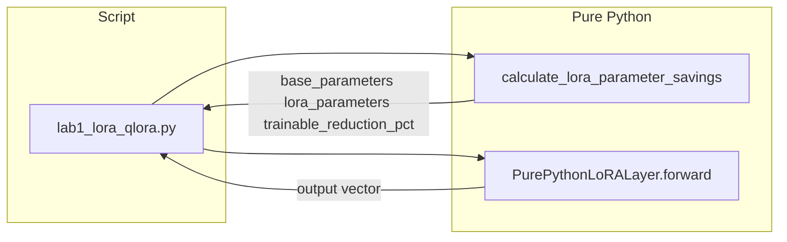

# Lab 1: LoRA / QLoRA

A Python file on disk has printed how many parameters a LoRA adapter trains versus the frozen base. No GPU. No HTTP POST. No adapter files written.

## What you touch
- Script: `lab1_lora_qlora.py`
- Class / functions: `PurePythonLoRALayer`, `PurePythonLoRALayer.forward`, `calculate_lora_parameter_savings`
- Keys printed: `base_parameters`, `lora_parameters`, `trainable_reduction_pct`
- URL / path: none. This script does not call `{OLLAMA_HOST}/api/generate`.

## Steps


1. Call `calculate_lora_parameter_savings(4096, 4096, 8)`. That is `in_features`, `out_features`, `rank`.
2. Print `base_parameters` (`4096 * 4096`), `lora_parameters` (`8 * 4096 + 4096 * 8`), and `trainable_reduction_pct`.
3. Build `PurePythonLoRALayer(in_features=128, out_features=128, rank=4)`.
4. Build a random input vector of length 128. Call `forward`. Print input length and output length.
5. Print `[PASSED]` when the forward pass returns a list of the same length. Do not write adapter files. Do not POST to Ollama.

## Data contract
Only the keys this script prints. There is no request JSON.

**Printed by `calculate_lora_parameter_savings`**

```json
{
  "base_parameters": 16777216,
  "lora_parameters": 65536,
  "trainable_reduction_pct": 99.61
}
```

`forward` returns a list of floats. Length equals `out_features` (128 in the demo).

## Run
From the repo root:

```bash
python education/optional_training/lab1_lora_qlora.py
```

```powershell
$env:OLLAMA_HOST="http://192.168.1.29:11434"
$env:OLLAMA_MODEL="qwen3.6:35b-a3b-65k"
python education/optional_training/lab1_lora_qlora.py
```

The script does not read `OLLAMA_HOST` or `OLLAMA_MODEL`. The env lines are here so this lab matches the other Run blocks.

## What you should see
A header `PARAMETER-EFFICIENT FINE-TUNING (LORA / QLORA)`, then:

```
Base Layer Parameters (W0)     : 16,777,216
LoRA Adapter Parameters (A+B) : 65,536
Trainable Parameter Reduction : 99.61%
```

Then `Input Vector Length : 128`, `Output Vector Length : 128`, and `[PASSED] Pure Python LoRA Forward Pass Completed Successfully!`

If you see an import error, you are not running the file in this folder. The script uses only `math` and `random` from the standard library.

## Stop here
This folder is optional. Finishing this lab does not unlock chapter 15. Do not start a GPU train. Do not write `adapter_config.json`. Do not export GGUF. Lab 2 in this folder is quantization, not a call to Ollama.

## Notes
- Drift vs `lab1_lora_qlora.py`: the module's intended contract is adapter files on disk. This script never writes those files, never loads a Hugging Face model, and never needs a GPU. QLoRA (4-bit base) is not implemented. `W0` is a random matrix, not a real model.
- Results from a real run. Questions that came up while running. Do not put module teaching here.
