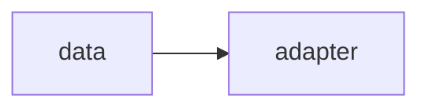

# Lab 1: LoRA/QLoRA

Reference training lab. Optional.

## Data
- Script: `lab1_lora_qlora.py`

## Information
Adapter train.

## Knowledge
Follow the script.

## Wisdom
Not on PATH.

## The When and Why
- **When:** you have a GPU and a dataset.
- **Why:** calling Ollama is enough for 00–15.

## How it works



## Data contract
adapter path

## Run

```bash
python education/optional_training/lab1_lora_qlora.py
```

## What you should see
A saved adapter or a dry-run note.

## What this becomes later
GGUF next if you export.

## Related
- **Chapter 00.**

## Notes

