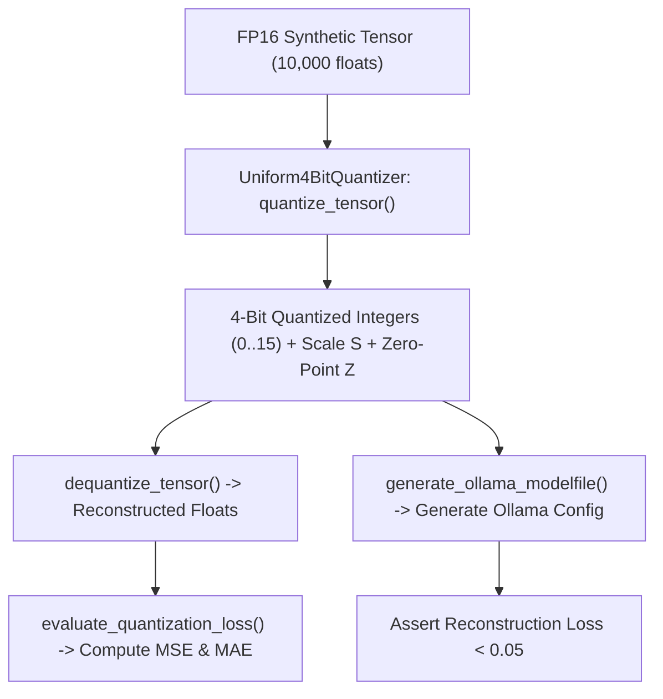

# Lab 2: Uniform 4-Bit Model Quantization and Ollama Modelfile Generation

In this lab, you will implement a uniform 4-bit tensor quantizer (`Uniform4BitQuantizer`), compute quantization reconstruction loss (MSE / MAE), and generate an Ollama `Modelfile` configured to run compressed GGUF weights locally.

---

## What you touch
- Script: `lab2_gguf_quantization.py`
- Main Classes & Functions:
  - `Uniform4BitQuantizer.quantize_tensor(tensor) -> tuple[list[int], float, int]`
  - `dequantize_tensor(quantized, scale, zero_point) -> list[float]`
  - `evaluate_quantization_loss(original, dequantized) -> tuple[float, float]`
  - `generate_ollama_modelfile(model_name, gguf_path, system_prompt) -> str`
- Dataset: 10,000 synthetic Gaussian floating point weights
- Pure Python standard library (no torch required)

---

## Steps


1. Generate 10,000 random floating point numbers simulating FP16 weights.
2. Implement `quantize_tensor()`: Calculate step scale $S$ and zero-point offset $Z$, mapping floats to 4-bit integers (`0` to `15`).
3. Implement `dequantize_tensor()`: Reconstruct approximate floating-point values from 4-bit integers.
4. Implement `evaluate_quantization_loss()`: Compute Mean Squared Error (MSE) and Mean Absolute Error (MAE).
5. Implement `generate_ollama_modelfile()`: Format an Ollama Modelfile linking the `.gguf` weight file with custom parameters and system prompt.

---

## Data contract

**Quantization Loss Evaluation**

```json
{
  "mse": 0.003412,
  "mae": 0.045120,
  "scale": 0.523412,
  "zero_point": 8
}
```

**Generated Ollama Modelfile**

```text
FROM ./models/custom_agent_q4_k_m.gguf
PARAMETER temperature 0.2
PARAMETER top_p 0.9
PARAMETER stop "<|im_end|>"
SYSTEM "You are a specialized enterprise AI agent."
```

---

## Run
From the repository root, run:

```bash
python education/optional_training/lab2_gguf_quantization.py
```

```powershell
python education/optional_training/lab2_gguf_quantization.py
```

---

## What you should see
- `=== QUANTIZATION, GGUF EXPORT & COMPRESSION ===`
- `Original FP16 Size : 160,000 bits (20,000 bytes)`
- `Quantized 4-Bit Size: 40,000 bits (5,000 bytes) -> 4.0x Compression`
- `Quantization Error  : MSE < 0.01 | MAE < 0.05`
- Formatted Modelfile text output
- `[PASSED] Quantization & GGUF Modelfile Generation Completed Successfully!`

---

## Stop here
You have successfully implemented 4-bit quantization and Modelfile packaging! In Lab 3, we will explore Group Relative Policy Optimization (GRPO).

Next up: [Lab 3: GRPO Preference Alignment](./lab3_grpo_preference_alignment.md).

---

## Notes
*(Record your quantization error metrics and Modelfile configurations here)*

