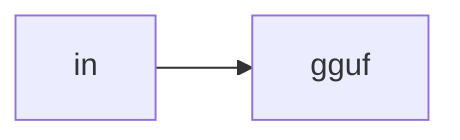

# Lab 2: GGUF quant

Reference export lab. Optional.

## Data
- Script: `lab2_gguf_quantization.py`

## Information
Quantize and write a file.

## Knowledge
Follow the script.

## Wisdom
Not on PATH.

## The When and Why
- **When:** VRAM is tight.
- **Why:** Ollama pull may already be quantized.

## How it works



## Data contract
file path

## Run

```bash
python education/optional_training/lab2_gguf_quantization.py
```

## What you should see
A `.gguf` or a documented skip.

## What this becomes later
GRPO if aligning.

## Related
- **llama.cpp.**

## Notes

