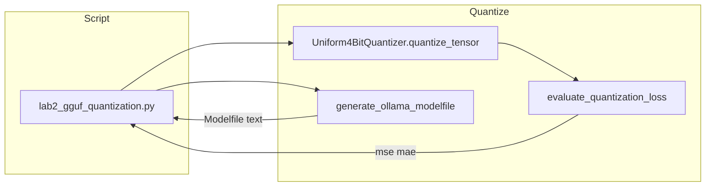

# Lab 2: GGUF quant

A Python file on disk has turned a list of floats into 4-bit integers and printed an Ollama Modelfile. No `.gguf` bytes are written. No HTTP POST.

## What you touch
- Script: `lab2_gguf_quantization.py`
- Class / functions: `Uniform4BitQuantizer`, `quantize_tensor`, `dequantize_tensor`, `evaluate_quantization_loss`, `generate_ollama_modelfile`
- Keys printed: `mse`, `mae`, scale `S`, zero-point `Z`, and a Modelfile whose `FROM` line is `./models/custom_agent_q4_k_m.gguf`
- URL / path: none. This script does not call `{OLLAMA_HOST}/api/generate`.

## Steps


1. Build 10,000 random floats with `random.seed(42)` and `random.gauss(0.0, 1.0)`.
2. Call `Uniform4BitQuantizer(bits=4).quantize_tensor`. Read back the integer list, `scale`, and `zero_point`.
3. Call `dequantize_tensor` on that list. Call `evaluate_quantization_loss` and print `mse` and `mae`.
4. Call `generate_ollama_modelfile` with `model_name="custom-agent-q4"`, `gguf_path="./models/custom_agent_q4_k_m.gguf"`, and a `system_prompt` string.
5. Print the Modelfile text. Do not write a `.gguf` file. Do not run `ollama create`. Do not POST to Ollama.

## Data contract
Only the values this script prints. There is no request JSON.

**Printed metrics**

```json
{
  "mse": 0.0,
  "mae": 0.0,
  "scale": 0.0,
  "zero_point": 0
}
```

**Printed Modelfile (text, not JSON)**

```
FROM ./models/custom_agent_q4_k_m.gguf
PARAMETER temperature 0.2
PARAMETER top_p 0.9
PARAMETER stop "<|im_end|>"
SYSTEM "You are a specialized enterprise AI agent."
```

The path in `FROM` is a string. The file is not created.

## Run
From the repo root:

```bash
python education/optional_training/lab2_gguf_quantization.py
```

```powershell
$env:OLLAMA_HOST="http://192.168.1.29:11434"
$env:OLLAMA_MODEL="qwen3.6:35b-a3b-65k"
python education/optional_training/lab2_gguf_quantization.py
```

The script does not read `OLLAMA_HOST` or `OLLAMA_MODEL`. The env lines are here so this lab matches the other Run blocks.

## What you should see
A header `QUANTIZATION, GGUF EXPORT & COMPRESSION`, then 16 bits vs 4 bits, a 4.0x compression line, a `scale` float, a `zero_point` int, `mse`, `mae`, the Modelfile text, and `[PASSED] Quantization & GGUF Modelfile Generation Completed Successfully!`

If you see an import error, you are not running the file in this folder. The script uses only `json`, `math`, and `random` from the standard library. `json` is imported and unused.

## Stop here
This folder is optional. Finishing this lab does not unlock chapter 15. Do not write a real `.gguf`. Do not run `ollama create`. Do not start GRPO unless you are studying post-training. If you only need a model to answer, POST to `http://192.168.1.29:11434` with `OLLAMA_MODEL=qwen3.6:35b-a3b-65k`.

## Notes
- Drift vs `lab2_gguf_quantization.py`: the module's intended contract is a `.gguf` path on disk. This script never writes `.gguf` bytes. It quantizes 10,000 random floats and prints a Modelfile string. `generate_ollama_modelfile` takes `model_name` and does not put that name in the returned text.
- Results from a real run. Questions that came up while running. Do not put module teaching here.
