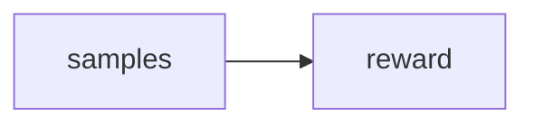

# Lab 3: GRPO

Reference RL lab. Optional.

## Data
- Script: `lab3_grpo_preference_alignment.py`

## Information
Group rewards.

## Knowledge
Follow the script.

## Wisdom
Not on PATH.

## The When and Why
- **When:** you are studying R1-style training.
- **Why:** the path does not require it.

## How it works



## Data contract
reward number

## Run

```bash
python education/optional_training/lab3_grpo_preference_alignment.py
```

## What you should see
A logged reward or dry-run.

## What this becomes later
Back to PATH 00 if you were only curious.

## Related
- **Chapter 12.**

## Notes

