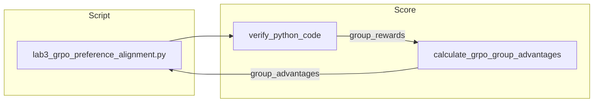

# Lab 3: GRPO preference alignment

A Python file on disk has scored four hardcoded snippets and printed a group-relative advantage for each one. No model is loaded. No weights are updated. No HTTP POST.

## What you touch
- Script: `lab3_grpo_preference_alignment.py`
- Class / functions: `verify_python_code`, `calculate_grpo_group_advantages`, `GRPOAlignmentEngine.run_alignment_step`
- Keys returned: `status`, `group_rewards`, `group_advantages`
- URL / path: none. This script does not call `{OLLAMA_HOST}/api/generate`.

## Steps


1. Build four candidate strings for `is_even(n)` (two that print `True`, one that prints `False`, one that is a syntax error).
2. Call `GRPOAlignmentEngine.run_alignment_step` with `prompt`, that list, and `expected_output="True"`.
3. For each candidate, `verify_python_code` writes the string to a temp file, runs it with `subprocess.Popen` (`timeout=3`), and returns `1.0` if `expected_output` is in stdout, else `0.0`.
4. Call `calculate_grpo_group_advantages` on that reward list. Print each reward and each advantage.
5. Print the JSON payload with `status`, `group_rewards`, and `group_advantages`. Do not load a model. Do not POST to Ollama. Do not write weights.

## Data contract
Only the keys this script returns. There is no request JSON.

**Return of `run_alignment_step` for the hardcoded `is_even` group**

```json
{
  "status": "SUCCESS",
  "group_rewards": [1.0, 0.0, 1.0, 0.0],
  "group_advantages": [1.0, -1.0, 1.0, -1.0]
}
```

`group_rewards` is a list of floats. `group_advantages` is a list of floats of the same length. A positive advantage means the policy would increase that candidate. A negative advantage means it would decrease it.

## Run
From the repo root:

```bash
python education/optional_training/lab3_grpo_preference_alignment.py
```

```powershell
$env:OLLAMA_HOST="http://192.168.1.29:11434"
$env:OLLAMA_MODEL="qwen3.6:35b-a3b-65k"
python education/optional_training/lab3_grpo_preference_alignment.py
```

The script does not read `OLLAMA_HOST` or `OLLAMA_MODEL`. The env lines are here so this lab matches the other Run blocks.

## What you should see
A header `GRPO PREFERENCE ALIGNMENT`, the prompt, `G = 4`, then four candidate lines (`PASSED` / `FAILED` with `R_i = 1.0` or `0.0`), then four advantage lines, then a JSON payload with `status`, `group_rewards`, and `group_advantages`.

If a candidate hangs, `verify_python_code` times out at 3 seconds and returns `0.0`. If you see an import error, you are not running the file in this folder. The script uses the standard library only (`json`, `math`, `random`, `subprocess`, `sys`, `tempfile`). `random` is imported and unused.

## Stop here
This folder is optional. Finishing this lab does not unlock chapter 15. Do not wire GRPO into chapter 04 or chapter 15. Do not start a real policy train. If you only need a model to answer, go back to chapter 00 and POST to `http://192.168.1.29:11434`.

## Notes
- Drift vs `lab3_grpo_preference_alignment.py`: the module's intended contract is a reward number plus a policy update. This script never loads a model and never writes weights. Candidates are four hardcoded strings. `verify_python_code` runs each string in a temp dir and returns `1.0` or `0.0`.
- Results from a real run. Questions that came up while running. Do not put module teaching here.
