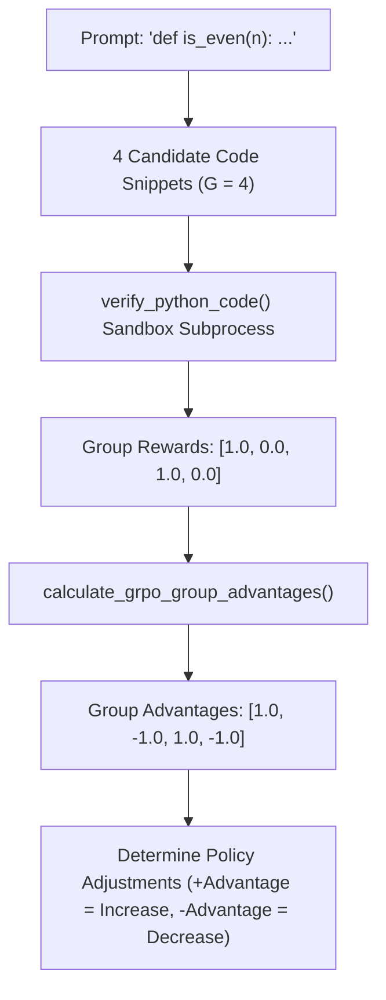

# Lab 3: Group Relative Policy Optimization (GRPO) Preference Alignment

In this lab, you will implement a GRPO relative advantage evaluator (`calculate_grpo_group_advantages`, `GRPOAlignmentEngine`) that executes and scores a group of candidate Python completions against unit test assertions to compute policy adjustment advantages.

---

## What you touch
- Script: `lab3_grpo_preference_alignment.py`
- Main Classes & Functions:
  - `verify_python_code(code: str, expected_output: str) -> float`: Evaluates code correctness in an isolated subprocess (returns `1.0` or `0.0`).
  - `calculate_grpo_group_advantages(rewards: list[float]) -> list[float]`: Computes normalized group advantages $A_i = \frac{R_i - \mu}{\sigma + \epsilon}$.
  - `GRPOAlignmentEngine.run_alignment_step(prompt, candidate_outputs, expected_output) -> dict`
- Test Fixtures: 4 candidate implementations of `is_even(n)` (two correct, one incorrect, one syntax error)
- Pure Python standard library (no torch required)

---

## Steps


1. Define 4 candidate implementations for `is_even(n)`:
   - Candidate 1 & 3: Valid logic printing `True`.
   - Candidate 2: Incorrect logic printing `False`.
   - Candidate 4: Broken syntax throwing `SyntaxError`.
2. Implement `verify_python_code()`: Execute code inside a temporary sandbox subprocess and check stdout for expected text (`"True"`).
3. Implement `calculate_grpo_group_advantages()`:
   - Calculate group reward mean $\mu$ and standard deviation $\sigma$.
   - Calculate advantages: $A_i = (R_i - \mu) / (\sigma + 1e-8)$.
4. Run `GRPOAlignmentEngine.run_alignment_step()` and assert that correct solutions obtain positive advantages ($+1.0$) and failing solutions obtain negative advantages ($-1.0$).

---

## Data contract

**GRPO Alignment Step Result**

```json
{
  "status": "SUCCESS",
  "group_rewards": [1.0, 0.0, 1.0, 0.0],
  "group_advantages": [1.0, -1.0, 1.0, -1.0]
}
```

---

## Run
From the repository root, run:

```bash
python education/optional_training/lab3_grpo_preference_alignment.py
```

```powershell
python education/optional_training/lab3_grpo_preference_alignment.py
```

---

## What you should see
- `=== GRPO PREFERENCE ALIGNMENT ===`
- `Group Evaluation (G = 4):`
  - Candidate 1: `[PASSED] Reward R_1 = 1.0 | Advantage A_1 = +1.0000 -> (POLICY: INCREASE)`
  - Candidate 2: `[FAILED] Reward R_2 = 0.0 | Advantage A_2 = -1.0000 -> (POLICY: DECREASE)`
  - Candidate 3: `[PASSED] Reward R_3 = 1.0 | Advantage A_3 = +1.0000 -> (POLICY: INCREASE)`
  - Candidate 4: `[FAILED] Reward R_4 = 0.0 | Advantage A_4 = -1.0000 -> (POLICY: DECREASE)`
- Return payload showing `status: SUCCESS` and advantage lists.

---

## Stop here
You have successfully implemented Group Relative Policy Optimization (GRPO) advantage calculation! You have finished the optional training module.

---

## Notes
*(Record your GRPO rewards, advantage calculations, and policy directions here)*

