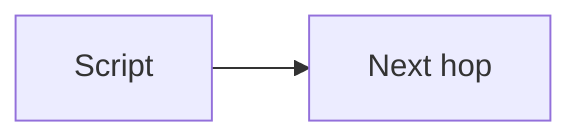

# Lab {N}: {Title}

One-line job of this lab. What you can do after it that you could not do before.

## Data
The literal thing this script touches. File, URL, JSON keys, function names.

## Information
What happens when you run it. One sentence for the path the data takes.

## Knowledge
What the script does, in the order it does it. Numbered. No extra theory.

## Wisdom
What this lab is *not*. The next chapter that reuses this script.

## The When and Why
- **When:** you run this lab.
- **Why:** this is the smallest script that proves the idea.

## How it works



## Data contract
The exact JSON or args this script sends and reads.

**Request**

```json
{}
```

**Response**

```json
{}
```

## Run
From the repo root:

```bash
python education/00_atoms/labN_name.py
```

Optional env:

```bash
export OLLAMA_HOST=http://192.168.1.29:11434
export OLLAMA_MODEL=qwen3.6:35b-a3b-65k
```

## What you should see
Expected prints. One "if this fails" line.

## What this becomes later
One sentence pointing at the next chapter that reuses this script.

## Related
One or two sentences each. Delete the header if empty.

## Notes
Questions and results from a real run. Metrics if you have them. No asides.
