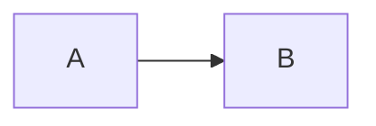

# {NN}: {Title}

One-line job of this chapter. What new idea exists after you finish it that did not exist before.

## Data
The literal thing. File, port, process, JSON keys, function names.
Three to five sentences. No metaphor. No product pitch.

## Information
What those facts mean together. One short picture of the flow.
If a mermaid would say it better, put the mermaid in **How it works** and keep this section to prose.

## Knowledge
How you use it. The steps a person actually takes.
The paired lab is this section made runnable.

## Wisdom
The judgment call. When this is the right tool, and when the simpler thing from an earlier chapter is enough.
Do not restate Knowledge.

## The When and Why
- **When:** the situation that makes this necessary.
- **Why:** what breaks if you skip it, or if you reach for a heavier version too early.

## How it works
One mermaid or ASCII flow. Then a short walkthrough of a single request or turn.



## Data contract
Inbound shape (JSON or function args). Outbound shape (JSON or return value).
Required keys only. Types next to names.

**Request**

```json
{}
```

**Response**

```json
{}
```

## Lab
Link the paired files. Say what "done" looks like in one sentence.

- Module: [this file](./{module_file}.md)
- Lab: [{lab_file}.py](./{lab_file}.py) / [{lab_file}.md](./{lab_file}.md)

## Related
One or two sentences each. Only things that do the same job.
If there are no honest siblings, delete this header.

- **Name:** what it is, when you would pick it instead.

## Notes
Living Q&A from real runs. Plain sentences. No asides. No "btw".
