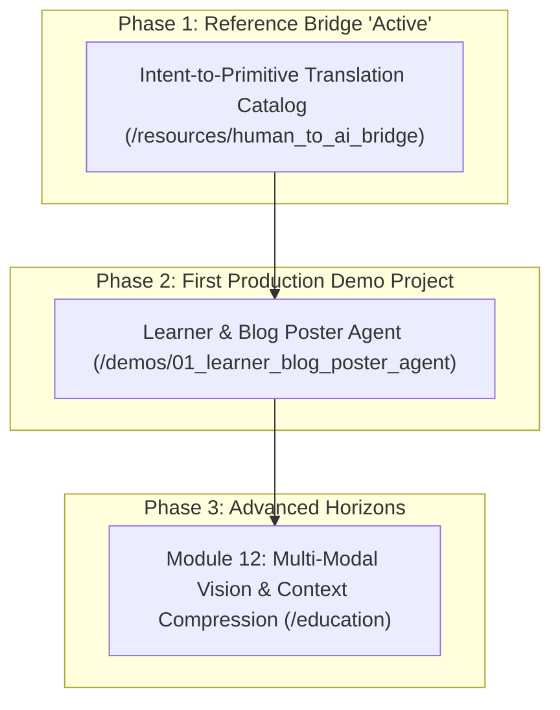

# Agentic & Autonomous AI Labs: Living Master Roadmap

This living roadmap tracks the transition from Track 1 (mastering low-abstraction primitives in `/education`) to Track 2 (building production applications in `/demos`).

---

## 📍 Current Active Phase Pointer

- **Current Active Phase**: **Phase 1: Intent-to-Primitive Reference Bridge** (`/resources/human_to_ai_bridge`).
- **Target Goal**: Construct a plain-English translation catalog mapping user business intent to exact software primitives, and package it as a custom Antigravity skill/rule for AI coding assistants.
- **Next Phase**: **Phase 2: Learner & Blog Poster Agent** (`/demos/01_learner_blog_poster_agent`).

---

## 🗺️ Master Strategic Roadmap

---

## 📋 Detailed Phase Breakdowns

### Phase 1: Intent-to-Primitive Reference Bridge (IN PROGRESS)
- [x] Reorganize workspace into `/education`, `/resources`, and `/demos`.
- [x] Create `resources/human_to_ai_bridge/intent_to_primitive_catalog.md` mapping plain-English user descriptions to exact 34 lab primitives.
- [x] Create `resources/human_to_ai_bridge/prompt_template.md` copy-paste prompt template for instructing AI assistants.
- [x] Update `AGENTS.md` rules with the Intent-to-Primitive system prompt mapping.

### Phase 2: First Production Demo Project — Learner & Blog Poster Agent (UPCOMING)
- [ ] Architecture design: Session state hydrator + ReAct kernel + Sandboxed execution worker + SDUI HITL approval gate.
- [ ] Subsystem 1: Content Research & Synthesis Agent (Ingests lab docs, extracts takeaways).
- [ ] Subsystem 2: Blog Post Generator (Formats articles for personal blog).
- [ ] Subsystem 3: LinkedIn Post Automation (Creates concise social summaries).
- [ ] Subsystem 4: Human-in-the-Loop Gate (Requires token approval before live publishing).

### Phase 3: Module 12 — Advanced Horizons (PLANNED)
- [ ] Lab 1: Multi-Modal Vision & Image Generation Integration.
- [ ] Lab 2: Context Window Compression & Summarization Buffers.
- [ ] Lab 3: Distributed MCP (Model Context Protocol) Server Integration.
