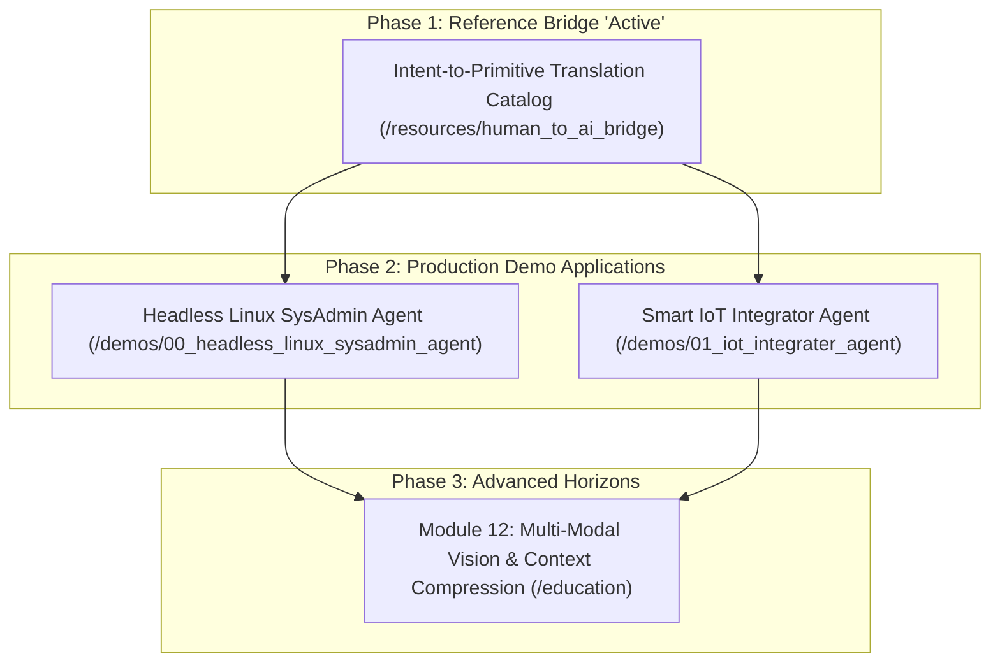

# Agentic & Autonomous AI Labs: Living Master Roadmap

This living roadmap tracks the transition from Track 1 (mastering low-abstraction primitives in `/education`) to Track 2 (building production applications in `/demos`).

---

## 📍 Current Active Phase Pointer

- **Current Active Phase**: **Phase 1: Intent-to-Primitive Reference Bridge** (`/resources/human_to_ai_bridge`).
- **Target Goal**: Construct a plain-English translation catalog mapping user business intent to exact software primitives, and package it as a custom Antigravity skill/rule for AI coding assistants.
- **Next Phase**: **Phase 2: Production Demo Applications** (`/demos/00_headless_linux_sysadmin_agent` & `/demos/01_iot_integrater_agent`).

---

## 🗺️ Master Strategic Roadmap

---

## 📋 Detailed Phase Breakdowns

### Phase 1: Intent-to-Primitive Reference Bridge (IN PROGRESS)
- [x] Reorganize workspace into `/education`, `/resources`, and `/demos`.
- [x] Create `resources/human_to_ai_bridge/intent_to_primitive_catalog.md` mapping plain-English user descriptions to exact 34 lab primitives.
- [x] Create `resources/human_to_ai_bridge/prompt_template.md` copy-paste prompt template for instructing AI assistants.
- [x] Update `AGENTS.md` rules with the Intent-to-Primitive system prompt mapping.

### Phase 2: Production Demo Applications (UPCOMING)

#### 00_headless_linux_sysadmin_agent
- [ ] Architecture design: Session state hydrator + ReAct kernel + Sandboxed execution worker + SDUI HITL approval gate.
- [ ] Subsystem 1: System Monitoring & Telemetry Collector (Ingests log files, system metrics, hardware status).
- [ ] Subsystem 2: Incident Diagnosis & Script Generator (Generates shell scripts and repair actions).
- [ ] Subsystem 3: Automated Verification Harness (Executes checks inside sandboxed subprocess).
- [ ] Subsystem 4: Human-in-the-Loop Safety Gate (Requires explicit clearance before running mutative/root commands).

#### 01_iot_integrater_agent
- [ ] Architecture design: MQTT/HTTP event subscriber + Async task queue + Logit steering + SDUI alert dashboard.
- [ ] Subsystem 1: Sensor Telemetry Ingestion (Collects real-time MQTT payload feeds from smart home/industrial devices).
- [ ] Subsystem 2: Anomaly Detection & Rule Engine (Identifies out-of-bounds readings and state changes).
- [ ] Subsystem 3: Automated Actuator Commands (Dispatches state patches to smart switches, relays, and controllers).

### Phase 3: Module 12 — Advanced Horizons (PLANNED)
- [ ] Lab 1: Multi-Modal Vision & Image Generation Integration.
- [ ] Lab 2: Context Window Compression & Summarization Buffers.
- [ ] Lab 3: Distributed MCP (Model Context Protocol) Server Integration.
