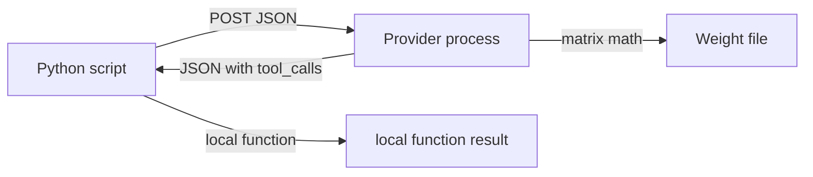

# Script, provider, weights

Three boxes. The HTTP API sits between the script and the weight file. The script never opens the weight file. The weight file never sees the script.

## Three boxes

1. **Python script.** Builds JSON (`model`, `messages` or `prompt`, `tools`, `stream`). POSTs. Runs local functions when it sees `tool_calls`. [Chapter 00](../../education/00_atoms/00_script_provider_weights.md), [chapter 03](../../education/03_the_dispatcher/00_tool_dispatch.md), [chapter 04](../../education/04_the_loop/00_the_react_loop.md).
2. **Provider process** (Ollama / vLLM / llama.cpp / a cloud HTTP API). Listens on a port. Tokenizes. Runs the weights. May format or constrain tokens so the response JSON has `message.tool_calls`. [Chapter 00](../../education/00_atoms/00_script_provider_weights.md), [chapter 01](../../education/01_the_call/00_the_wrapper_and_the_stream.md).
3. **Weight file** (`.gguf` / `.safetensors`). Numbers on disk. No port. No HTTP. [Chapter 00](../../education/00_atoms/00_script_provider_weights.md), [optional_training](../../education/optional_training/02_gguf.md).

## Where `tool_calls` come from

This is three steps. Do not collapse them.

- The **script** sends the tool schema in the request (`tools` / `TOOLS_SCHEMA`). [Chapter 03](../../education/03_the_dispatcher/00_tool_dispatch.md).
- The **model** (via the provider) emits tokens. The provider turns those tokens into a JSON body. If the model chose a tool, that body has `message.tool_calls`. [Chapter 03](../../education/03_the_dispatcher/00_tool_dispatch.md), [chapter 01](../../education/01_the_call/00_the_wrapper_and_the_stream.md).
- The **script** reads `tool_calls`, looks up `TOOL_REGISTRY`, runs the function, appends `role: tool`. [Chapter 03](../../education/03_the_dispatcher/00_tool_dispatch.md), [chapter 04](../../education/04_the_loop/00_the_react_loop.md). The provider does not run bash or Ansible.

Lab 1 is one POST and the three names: [lab1_script_posts_json.md](../../education/00_atoms/lab1_script_posts_json.md).

When the question is tool vs wrapper vs two loops vs a job row, use [01_when_x_vs_y.md](./01_when_x_vs_y.md).
