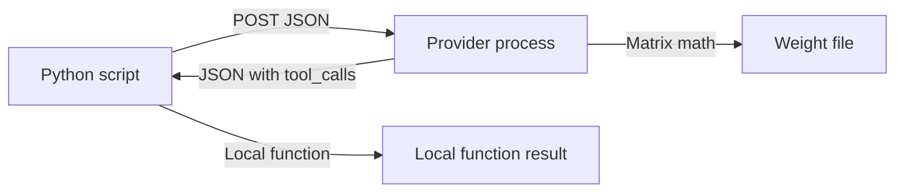

# Script, Provider, and Weights

When building AI applications, it helps to understand the three distinct parts that work together: your Python script, the provider process, and the model weight file.

An HTTP API sits between your script and the weight file. Your script never opens the weight file directly, and the weight file never interacts directly with your script.

## The Three Parts

1. **Python script**: This is the code you write and run. It creates a JSON request (specifying fields like `model`, `messages` or `prompt`, `tools`, and `stream`) and sends it over HTTP as a POST request. When the provider responds with `tool_calls`, your script runs the matching local functions. Learn more in [Chapter 00](../../education/00_atoms/00_script_provider_weights.md), [Chapter 03](../../education/03_the_dispatcher/00_tool_dispatch.md), and [Chapter 04](../../education/04_the_loop/00_the_react_loop.md).
2. **Provider process**: This is a running server (such as Ollama, vLLM, llama.cpp server, or a cloud API) that listens on a network port. It accepts your request, converts text into tokens, runs calculations using the loaded weights, and returns a JSON response. If the model selects a tool, the provider packages that choice into `message.tool_calls`. Learn more in [Chapter 00](../../education/00_atoms/00_script_provider_weights.md) and [Chapter 01](../../education/01_the_call/00_the_wrapper_and_the_stream.md).
3. **Weight file**: This is a file on disk (such as `.gguf` or `.safetensors`) containing the trained model parameters (numbers). It does not open a network port or handle HTTP requests. The provider process loads these weights into memory (RAM or VRAM) to do the math. Learn more in [Chapter 00](../../education/00_atoms/00_script_provider_weights.md) and [Optional Training](../../education/optional_training/02_gguf.md).

## How `tool_calls` Flow Through the System

When a model chooses to run a tool, the interaction follows three clear steps:

- **Step 1: The script sends available tools.** Your Python script sends tool definitions in the request payload under `tools` or `TOOLS_SCHEMA`. [Chapter 03](../../education/03_the_dispatcher/00_tool_dispatch.md).
- **Step 2: The provider returns the decision.** The model generates tokens, and the provider formats them into a JSON response. If the model chooses to call a tool, the response includes `message.tool_calls`. [Chapter 03](../../education/03_the_dispatcher/00_tool_dispatch.md), [Chapter 01](../../education/01_the_call/00_the_wrapper_and_the_stream.md).
- **Step 3: The script runs the code locally.** Your script receives the JSON, reads `tool_calls`, finds the matching function in `TOOL_REGISTRY`, runs it, and adds the result with `role: tool`. The provider only recommends which tool to call; your Python script is what actually executes the function. [Chapter 03](../../education/03_the_dispatcher/00_tool_dispatch.md), [Chapter 04](../../education/04_the_loop/00_the_react_loop.md).

To practice sending a single POST request and seeing the response, see [lab1_script_posts_json.md](../../education/00_atoms/lab1_script_posts_json.md).

When you need guidance on choosing between a tool, a wrapper function, multi-loop agents, or a job queue, see [01_when_x_vs_y.md](./01_when_x_vs_y.md).
