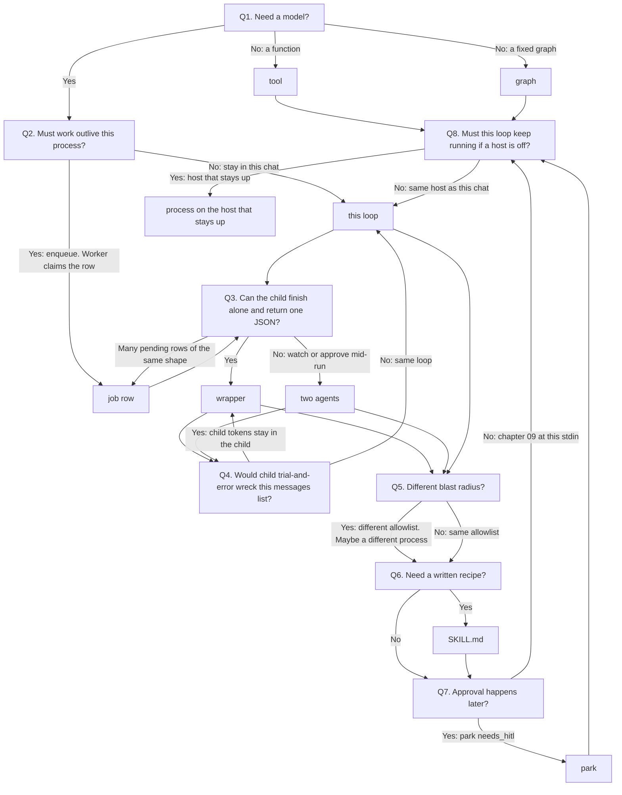

# When X vs Y

This is the form. Answer in order. Each answer names a course object. Do not start from a second kernel. Cron can enqueue a [chapter 16](../../education/16_the_job/00_the_job.md) job. A second kernel is only when a loop must reason on its own schedule and a wrapper cannot finish and return JSON. See the sibling page [08 03_skill_vs_two_agents](../../education/08_two_agents/03_skill_vs_two_agents.md).

If a page disagrees with a lab brief, the brief wins.

## The questions

### Q1. Does this step need a model?

- No: write a function ([chapter 03](../../education/03_the_dispatcher/00_tool_dispatch.md) tool) or a fixed graph ([chapter 06](../../education/06_the_workflow/01_graph_workflows.md), [00_deterministic_dags.md](../../education/06_the_workflow/00_deterministic_dags.md)). The function still has a host. If it must run when another box is off, put the script on the host that stays up (Q8). Stop.
- Yes: Q2.

### Q2. Must the work outlive this chat process (run after you close the terminal, or when you are not talking)?

- Yes: a job row ([chapter 16](../../education/16_the_job/00_the_job.md)). A second process is a worker that claims rows (`claimed_by` in [lab2_two_workers.md](../../education/16_the_job/lab2_two_workers.md)), not a new personality. Cron can write the row. That is not a second kernel. Q3 still applies to what the worker runs.
- No: stay in this loop ([04](../../education/04_the_loop/00_the_react_loop.md) / [07](../../education/07_one_agent/00_persona_tools_loop_state.md)). Q3.

### Q3. Can the child finish alone and return one JSON?

- Yes: skill wrapper ([08 03_skill_vs_two_agents](../../education/08_two_agents/03_skill_vs_two_agents.md)). Parent blocks. Child messages stay in the child.
- No, you must watch or approve mid-run: two agents plus the five-key handoff ([08 01_handoff_protocol](../../education/08_two_agents/01_handoff_protocol.md)).
- Many pending rows of the same shape: [16 lab2](../../education/16_the_job/lab2_two_workers.md) workers.

### Q4. Would the child's trial-and-error wreck this `messages` list?

- Yes: wrapper / child loop ([08 03](../../education/08_two_agents/03_skill_vs_two_agents.md)). Do not keep a forever coding chat. Memory is facts and files ([13](../../education/13_memory/01_agentic_memory.md) `facts.json`, [lab2](../../education/13_memory/lab2_episodic_vs_procedural.md)), not an endless `messages` array.
- No: same loop ([04](../../education/04_the_loop/00_the_react_loop.md) / [07](../../education/07_one_agent/00_persona_tools_loop_state.md)).

### Q5. Different blast radius (read logs vs run Ansible)?

- Yes: different tool allowlist ([09](../../education/09_the_shield/lab2_permissions.md) `lookup_permission`, [lab3 RBAC](../../education/09_the_shield/lab3_agent_rbac.md) `ROLE_TOOL_PERMISSIONS`). Maybe a different process. Not a staff name. See [notes 01](../notes/01_where_not_who.md).
- No: same allowlist.

### Q6. Need a written recipe?

- Yes: `SKILL.md` ([14 lab2](../../education/14_mcp/lab2_skills.md), [01_skills_and_plugins.md](../../education/14_mcp/01_skills_and_plugins.md)). Still not a loop.
- No: skip.

### Q7. Approval happens later, not at this stdin?

- Yes: park `needs_hitl` ([18](../../education/18_park_and_resume/00_park_and_resume.md) `park_job`).
- No: [chapter 09](../../education/09_the_shield/01_security_overview.md) is enough if the person is here now (`lookup_permission`, `execute_action_with_hitl_gate` in [lab4](../../education/09_the_shield/lab4_hitl_generative_ui.md)).

### Q8. Must this loop keep running if a given host is off?

- Yes: the process (or the cron that writes the [16](../../education/16_the_job/00_the_job.md) job) lives on the host that stays up. Other machines are tool targets (`run_playbook`, SSH, HTTP). That is `host_id` ([notes 01](../notes/01_where_not_who.md)). Not a second repo and not an agent install on every box.
- No: same host as this chat.

## Worked examples

Homelab. Device keys, not people. [notes 01](../notes/01_where_not_who.md).

- Run `ansible-playbook` on a filepath: Q1 is no. Write a [chapter 03](../../education/03_the_dispatcher/00_tool_dispatch.md) tool named `run_playbook`.
- "Follow these Ansible rules": Q6. Load a [`SKILL.md`](../../education/14_mcp/lab2_skills.md) into whoever writes the yaml. The run is still the `run_playbook` tool.
- Tail logs every 5 minutes: Q1 maybe a regex script (tool) or a small model. Q2 is yes. Cron writes a [job row](../../education/16_the_job/00_the_job.md), or a process that only enqueues. Not a person named Observability.
- "Any alerts on jarvis?": one router ([notes 02](../notes/02_one_router.md)). `ask_host` wrapper ([08 03](../../education/08_two_agents/03_skill_vs_two_agents.md)). `jarvis` is `host_id` ([notes 01](../notes/01_where_not_who.md)).
- Messy coding pipeline: Q3 wrapper. Q4 is yes, so the child dies. Memory of past fixes is [13](../../education/13_memory/01_agentic_memory.md) facts / files, not a living coding-agent chat.
- Mutative SSH on `net`: Q5 allowlist ([09](../../education/09_the_shield/lab2_permissions.md) / [lab3](../../education/09_the_shield/lab3_agent_rbac.md)) plus [09 HITL](../../education/09_the_shield/lab4_hitl_generative_ui.md) or [18](../../education/18_park_and_resume/00_park_and_resume.md) park.
- Watering if the GPU box is off: Q1 is no for the valve. Cron or GPIO on the Pi. A loop that reasons about pH lives on the always-on host (Q8). The Pi is a tool target.

## Decision tree

Sibling: [08 03_skill_vs_two_agents.md](../../education/08_two_agents/03_skill_vs_two_agents.md). Course map: [02_path_canvas.md](./02_path_canvas.md). Dual-name tree: [notes 04](../notes/04_shape_tree.md).
