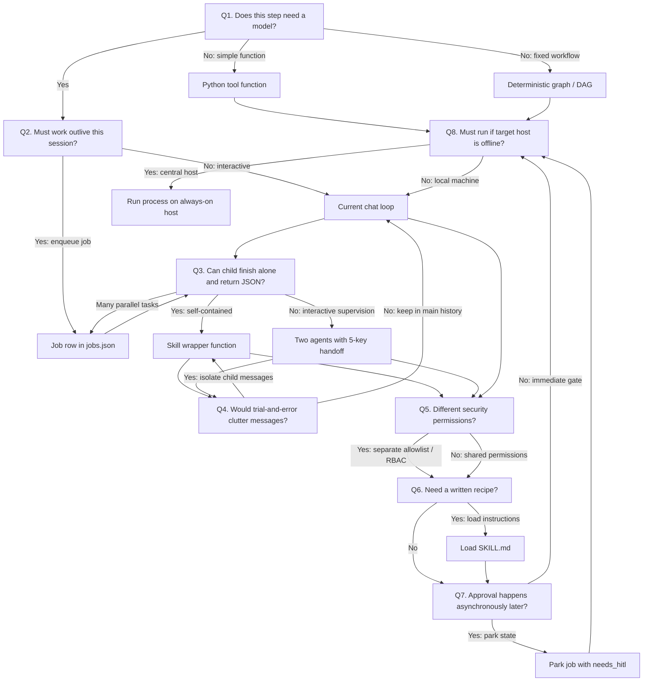

# Architectural Decision Guide: When to Use Pattern X vs Pattern Y

When designing an agentic system, it is tempting to jump straight into complex architectures like multi-agent networks or distributed workers. In practice, starting with the simplest pattern that solves your problem leads to more reliable, maintainable code.

Use this step-by-step questionnaire to determine the exact pattern you need. Answer the questions in order; each answer points directly to a concept taught in this course.

> **Note**: If a decision guide ever conflicts with a specific lab brief, the lab brief always takes priority.

---

## The Decision Questions

### Question 1: Does this step actually need an AI model?

- **No**: Write a standard Python function (a tool in [Chapter 03](../../education/03_the_dispatcher/00_tool_dispatch.md)) or define a deterministic pipeline / graph ([Chapter 10](../../education/10_the_workflow/00_deterministic_dags.md)). If this script must run even when your main workstation is offline, place it on a server that stays online (see Question 8). You are done!
- **Yes**: Proceed to **Question 2**.

### Question 2: Must the work outlive the current chat session?
*(For example, should it keep running in the background after you close your terminal or when no user is actively interacting?)*

- **Yes**: Create a persistent job record in a database or file ([Chapter 18](../../education/18_the_job/00_the_job.md)). A background worker process can claim the job using a field like `claimed_by` ([Chapter 18 Lab 2](../../education/18_the_job/lab2_two_workers.md)). A scheduled cron job can also enqueue work this way without needing a separate agent persona. Next, use **Question 3** to design how the worker executes the task.
- **No**: Keep execution within your current agent loop ([Chapter 04](../../education/04_the_loop/00_the_react_loop.md) and [Chapter 13](../../education/13_one_agent/00_persona_tools_loop_state.md)). Proceed to **Question 3**.

### Question 3: Can the subtask run independently and return a single JSON result?

- **Yes**: Use a **skill wrapper function** ([Chapter 14: Skill vs Two Agents](../../education/14_two_agents/03_skill_vs_two_agents.md)). The parent agent pauses and waits while the child process completes its work. Intermediate messages remain contained inside the child process.
- **No (A human or parent agent must inspect and approve progress mid-run)**: Use two coordinating agents communicating via the standard five-key handoff protocol ([Chapter 14: Handoff Protocol](../../education/14_two_agents/01_handoff_protocol.md)).
- **Handling many pending items of the same shape**: Use background worker queues ([Chapter 18 Lab 2](../../education/18_the_job/lab2_two_workers.md)).

### Question 4: Would trial-and-error clutter the main conversation history?

- **Yes**: Run the trial-and-error work inside an isolated child loop or wrapper ([Chapter 14: Skill vs Two Agents](../../education/14_two_agents/03_skill_vs_two_agents.md)). Keep your main `messages` history clean and focused. Store long-term knowledge as structured facts and files ([Chapter 09](../../education/09_agentic_memory_and_rag/01_agentic_memory.md) and [Chapter 09 Lab 1](../../education/09_agentic_memory_and_rag/lab1_episodic_vs_procedural.md)) rather than accumulating an endless list of chat messages.
- **No**: Stay within the same conversation loop ([Chapter 04](../../education/04_the_loop/00_the_react_loop.md) and [Chapter 13](../../education/13_one_agent/00_persona_tools_loop_state.md)).

### Question 5: Do different tasks require different security permissions (blast radius)?
*(For example, reading logs vs executing system commands like Ansible or shell scripts)*

- **Yes**: Configure separate tool allowlists and role-based permissions ([Chapter 16 Lab 2](../../education/16_the_shield/lab2_permissions.md) and [Chapter 16 Lab 3](../../education/16_the_shield/lab3_agent_rbac.md)). Separate capabilities by permissions and host locations rather than naming fictional employee roles (see [Note 01: Where, Not Who](../notes/01_where_not_who.md)).
- **No**: Use a single shared tool allowlist.

### Question 6: Does the task require a standardized procedure or written guidelines?

- **Yes**: Document the procedure in a `SKILL.md` file ([Chapter 15 Lab 2](../../education/15_mcp_and_skills/lab2_skills.md) and [Skills Overview](../../education/15_mcp_and_skills/01_skills_and_plugins.md)) and load it into the agent's prompt when needed.
- **No**: Continue to Question 7.

### Question 7: Does human approval need to happen asynchronously later?

- **Yes**: Transition the job to a parked state like `needs_hitl` so it can be resumed later ([Chapter 17](../../education/17_hitl_and_park_resume/00_hitl_and_park_resume.md)).
- **No (The user is present in the terminal right now)**: Use an immediate Human-In-The-Loop gate ([Chapter 16](../../education/16_the_shield/01_security_overview.md) and [Chapter 17 Lab 1](../../education/17_hitl_and_park_resume/lab1_hitl_approval.md)).

### Question 8: Must this loop continue running if a specific computer or workstation is powered off?

- **Yes**: Run the central agent process (or the cron job writing to `jobs.json`) on an always-on server. Other machines act as target devices accessed via tools (SSH, HTTP APIs, or command runners) using an explicit `host_id` ([Note 01: Where, Not Who](../notes/01_where_not_who.md)).
- **No**: Run everything locally on your current machine.

---

## Practical Examples

Here is how these questions apply to common real-world scenarios:

- **Run an Ansible playbook on a target server**: Question 1 is *No*. Create a deterministic tool named `run_playbook` ([Chapter 03](../../education/03_the_dispatcher/00_tool_dispatch.md)).
- **Ensure playbooks follow organizational standards**: Question 6 is *Yes*. Load a [`SKILL.md`](../../education/15_mcp_and_skills/lab2_skills.md) containing the guidelines into the agent generating the YAML. The actual execution remains the `run_playbook` tool.
- **Check system logs every 5 minutes**: Question 2 is *Yes*. A cron schedule writes a row to [Chapter 18's `jobs.json`](../../education/18_the_job/00_the_job.md), which a worker processes.
- **"Are there any alerts on server jarvis?"**: Use a single router ([Note 02](../notes/02_one_router.md)) and an `ask_host` wrapper ([Chapter 14](../../education/14_two_agents/03_skill_vs_two_agents.md)), specifying `jarvis` as the `host_id`.
- **Complex multi-step code generation**: Question 3 & 4 are *Yes*. Run the iterative trial-and-error loop in a child wrapper so the main chat remains clean. Save the final learnings to [Chapter 09's memory](../../education/09_agentic_memory_and_rag/01_agentic_memory.md).

---

## Visual Decision Tree

---

**Related Reading**:
- [Chapter 14: Skill vs Two Agents](../../education/14_two_agents/03_skill_vs_two_agents.md)
- [Course Architecture Canvas](./02_path_canvas.md)
- [Shape Tree Guide](../notes/04_shape_tree.md)

