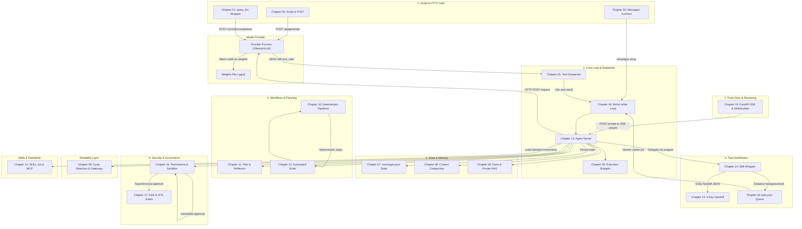

# Course Architecture Canvas

This visual map illustrates how all the architectural components built throughout this course connect to form a complete, production-grade agentic system.

Every block in this diagram represents a concrete Python file, function, or data contract taught in the labs—not third-party abstractions.

---

## Architectural Map

---

## Step-by-Step Scenario: "Are there any alerts on server jarvis?"

Let's walk through how a single user request travels through this architecture:

1. **Receiving the Request**: The user sends a query through the web client or CLI ([Chapter 19](../../education/19_the_front_door/00_fastapi_sse.md)), which passes it to the central agent kernel ([Chapter 13](../../education/13_one_agent/00_persona_tools_loop_state.md)).
2. **Consulting Skills**: The agent checks available guidelines ([Chapter 15](../../education/15_mcp_and_skills/lab2_skills.md)), noting that inquiries about specific target hosts should call the `ask_host` wrapper tool.
3. **Dispatching the Subtask**: The `ask_host` function ([Chapter 14](../../education/14_two_agents/03_skill_vs_two_agents.md)) enqueues a background job row tagged with `host_id: "jarvis"` into `jobs.json` ([Chapter 18](../../education/18_the_job/00_the_job.md)) or transfers context using the five-key handoff format ([Chapter 14 Lab 2](../../education/14_two_agents/lab2_agent_handoff.md)).
4. **Isolated Execution**: A worker assigned to server `jarvis` claims the job row ([Chapter 18 Lab 2](../../education/18_the_job/lab2_two_workers.md)), runs its own internal ReAct loop ([Chapter 04](../../education/04_the_loop/00_the_react_loop.md)), and uses local read-only diagnostic tools allowed by its RBAC security policy ([Chapter 16 Lab 3](../../education/16_the_shield/lab3_agent_rbac.md)).
5. **Returning the Clean Result**: The worker finishes its analysis and returns a clean JSON summary. The main agent receives this as a single `role: tool` message ([Chapter 03](../../education/03_the_dispatcher/00_tool_dispatch.md)) without polluting its conversation history with the worker's intermediate trial tokens.
6. **Safety & Human Approval**: If a corrective action is recommended that modifies server state, execution is gated by a Human-In-The-Loop check ([Chapter 16](../../education/16_the_shield/01_security_overview.md) and [Chapter 17](../../education/17_hitl_and_park_resume/00_hitl_and_park_resume.md)) rather than running unattended commands.
7. **Model Communication**: At every step, the model provider ([Chapter 01](../../education/01_the_call/00_the_wrapper_and_the_stream.md)) only generates text and tool decisions over HTTP POST. The Python runtime is responsible for executing tools and enforcing safety boundaries (see [Script, Provider, and Weights](./00_script_server_weights.md)).

---

## Keeping It Simple: Native Python vs Third-Party Frameworks

In this course, all agent logic is built directly in clear Python code. You do not need external dependencies like Redis, message brokers, or heavy framework abstractions to understand or build these patterns. 

Add infrastructure tools only when a real production constraint demands it (for instance, when a lightweight wrapper is no longer sufficient).

For help deciding which pattern to use, review [01_when_x_vs_y.md](./01_when_x_vs_y.md).

