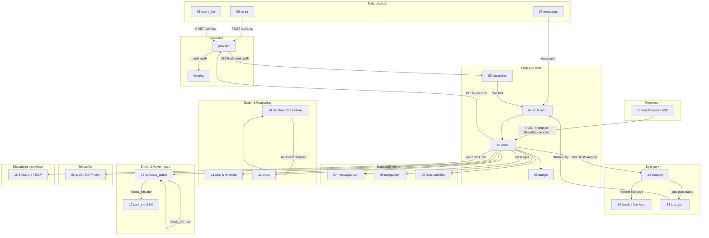

# Path canvas

One flowchart of the course. Not an enterprise product canvas. Objects below are files, JSON keys, and functions already in the labs.

HITL is evaluate_action ([16](../../education/16_the_shield/01_security_overview.md) `lookup_permission` / `execute_action_with_hitl_gate` in [17 lab1](../../education/17_hitl_and_park_resume/lab1_hitl_approval.md)) or `park_job` ([17](../../education/17_hitl_and_park_resume/00_hitl_and_park_resume.md)). Do not invent a product name for the pause.

Chapter files for the boxes: [00](../../education/00_atoms/00_script_provider_weights.md), [01](../../education/01_the_call/00_the_wrapper_and_the_stream.md), [02](../../education/02_the_contract/00_messages_and_json.md), [03](../../education/03_the_dispatcher/00_tool_dispatch.md), [04](../../education/04_the_loop/00_the_react_loop.md), [05](../../education/05_the_budget/00_the_budget.md), [06](../../education/06_the_reliability/00_cot_and_reasoning.md), [07](../../education/07_the_state/00_save_the_messages.md), [08](../../education/08_context_compaction/00_context_compaction.md), [09](../../education/09_agentic_memory_and_rag/01_agentic_memory.md), [10](../../education/10_the_workflow/01_graph_workflows.md), [11](../../education/11_planning_and_reflection/00_planning_and_reflection.md), [12](../../education/12_agent_evals/00_agent_evals.md), [13](../../education/13_one_agent/00_persona_tools_loop_state.md), [14 wrapper](../../education/14_two_agents/03_skill_vs_two_agents.md), [14 handoff](../../education/14_two_agents/01_handoff_protocol.md), [15](../../education/15_mcp_and_skills/00_mcp_overview.md), [16](../../education/16_the_shield/01_security_overview.md), [17](../../education/17_hitl_and_park_resume/00_hitl_and_park_resume.md), [18](../../education/18_the_job/00_the_job.md), [19](../../education/19_the_front_door/00_fastapi_sse.md), [20](../../education/20_synthesis/00_harness_overview.md).

## Guided walk: "any alerts on jarvis?"

One request.

1. The [chapter 19](../../education/19_the_front_door/00_fastapi_sse.md) client POSTs the prompt (or you type into the [13](../../education/13_one_agent/00_persona_tools_loop_state.md) kernel).
2. The core loop ([13](../../education/13_one_agent/00_persona_tools_loop_state.md)) may load a `SKILL.md` ([15 lab2](../../education/15_mcp_and_skills/lab2_skills.md)) that says: when the user names a host, call `ask_host`.
3. `ask_host` is an [14](../../education/14_two_agents/03_skill_vs_two_agents.md) wrapper: enqueue a job with `host_id` `jarvis` ([18](../../education/18_the_job/00_the_job.md)) or send handoff JSON ([14 01](../../education/14_two_agents/01_handoff_protocol.md)). `jarvis` is a `host_id` ([notes 01](../notes/01_where_not_who.md), [notes 02](../notes/02_one_router.md)).
4. The jarvis worker claims the row (`claimed_by` in [18 lab2](../../education/18_the_job/lab2_two_workers.md)), runs its own [04](../../education/04_the_loop/00_the_react_loop.md) loop, own tools (read logs). The [16](../../education/16_the_shield/lab3_agent_rbac.md) allowlist is read-only.
5. Result JSON returns. Core `messages` get one `role: tool` result ([03](../../education/03_the_dispatcher/00_tool_dispatch.md)), not jarvis trial tokens.
6. If a mutative fix is next, [17 HITL](../../education/17_hitl_and_park_resume/lab1_hitl_approval.md) or [17 park](../../education/17_hitl_and_park_resume/00_hitl_and_park_resume.md), not a silent root command.
7. The provider ([01](../../education/01_the_call/00_the_wrapper_and_the_stream.md)) is only the POST for tokens. Weights do not run Ansible. See [00](./00_script_server_weights.md).

Fill [01_when_x_vs_y.md](./01_when_x_vs_y.md) before you add a second process.

## Outside chats vs this course

If a canvas requires Redis, OpenTelemetry, or Docker to exist, it is a product sketch. Those products are optional and not in this course. The labs already have the objects. Add those products only when a lab object is not enough ([14](../../education/14_two_agents/03_skill_vs_two_agents.md) wisdom: no bus until a wrapper fails).
