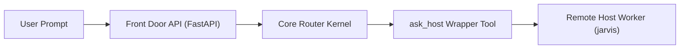

# The Single Router Pattern: A Clean Front Door for Multi-Device Environments

When building an agentic assistant for your infrastructure, users should interact with a single central entry point.

That central process combines three core building blocks from our curriculum:
1. The **Agent Kernel** ([Chapter 13](../../education/13_one_agent/00_persona_tools_loop_state.md)): Manages conversation state and orchestrates tools.
2. The **Topology Router** ([Chapter 14](../../education/14_two_agents/00_topologies.md)): Decides which subtask or target device needs to be called.
3. The **Front Door API** ([Chapter 19](../../education/19_the_front_door/00_fastapi_sse.md)): Serves streaming responses over FastAPI and Server-Sent Events (SSE).

---

## How It Works in Practice

Imagine a user asks: *"Are there any active alerts on server jarvis?"*

Instead of maintaining dozens of open SSH sessions or separate web interfaces, the central router handles the request using a clean tool call:

1. The user sends their prompt to the **Front Door API**.
2. The **Core Router** identifies that the request is for host `jarvis` and invokes a wrapper tool: `ask_host(host_id="jarvis", prompt="Check active alerts")`.
3. The `ask_host` function acts as a **Skill Wrapper** ([Chapter 14](../../education/14_two_agents/03_skill_vs_two_agents.md)). It packages the request using the five-key handoff format ([Chapter 14 Lab 2](../../education/14_two_agents/lab2_agent_handoff.md)) or enqueues a row in `jobs.json` ([Chapter 18](../../education/18_the_job/00_the_job.md)).
4. The worker for `jarvis` executes the inspection locally using its own read-only tools and returns a single JSON summary.
5. The core router receives this summary as a single tool response without polluting its conversation history with intermediate trial tokens.

---

## When to Wrap vs When to Run Multiple Agents

Follow this simple rule of thumb from Chapter 14:
- **Use a Skill Wrapper**: When the subtask can execute independently and return a single clean JSON result.
- **Use Two Live Agents**: When a user or supervisor must inspect, guide, or approve progress midway through execution.
- **Use Background Workers**: When handling many queued tasks asynchronously ([Chapter 18 Lab 2](../../education/18_the_job/lab2_two_workers.md)).

