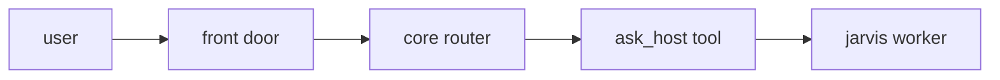

# One router

You talk to one process. That process is the [chapter 07](../../education/07_one_agent/00_persona_tools_loop_state.md) kernel plus [chapter 08](../../education/08_two_agents/00_topologies.md) routing plus [chapter 10](../../education/10_the_front_door/00_fastapi_sse.md) as the front door.

User says: "any alerts on jarvis?"
Router does not SSH itself unless that is a local tool. It calls a tool, for example `ask_host(host_id, prompt)`.

`ask_host` is a skill wrapper ([08](../../education/08_two_agents/03_skill_vs_two_agents.md)): it builds the five-key handoff ([01_handoff_protocol.md](../../education/08_two_agents/01_handoff_protocol.md)) or a job row in [16](../../education/16_the_job/00_the_job.md) and waits for one JSON result. The model on core never needs the child tokens.

When to use a skill wrapper vs two live loops, quote the [08 rule](../../education/08_two_agents/03_skill_vs_two_agents.md):

- If the child can finish alone, wrap it as a tool.
- If you need mid-run inspection, two agents.
- If many pending rows, [chapter 16 lab2](../../education/16_the_job/lab2_two_workers.md) workers.

SSH network admin on the same server as the router: that is a tool ([03](../../education/03_the_dispatcher/00_tool_dispatch.md)) with [chapter 09 HITL](../../education/09_the_shield/lab4_hitl_generative_ui.md) for mutative commands, or [chapter 18](../../education/18_park_and_resume/00_park_and_resume.md) park if the yes comes later. It is not a "network person." Same host as core is fine (`same_host_as` in the map).

The jarvis worker has its own loop, its own `messages` list, and its own tools.
