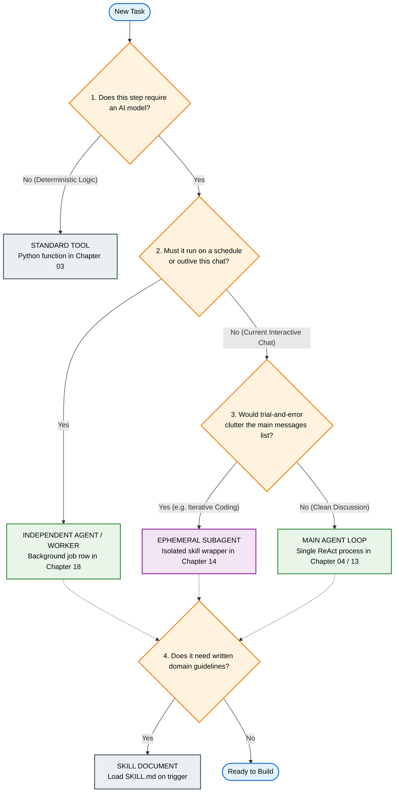

# The Architecture Shape Tree: Mapping Concepts to Code

This visual decision tree maps common industry terms directly to the concrete building blocks you create in this course.

Use this tree alongside [Architectural Decisions: When X vs Y](../decisions/01_when_x_vs_y.md) whenever you start designing a new capability.

---

## The Decision Tree

---

## Glossary of Architectural Leaves

| Term You Hear | Concrete Course Implementation |
|---|---|
| **Standard Tool** | A callable Python function registered in `TOOL_REGISTRY` and described in `TOOLS_SCHEMA` ([Chapter 03](../../education/03_the_dispatcher/00_tool_dispatch.md)). |
| **Independent Agent / Worker** | A background worker process that claims records from `jobs.json` ([Chapter 18](../../education/18_the_job/00_the_job.md)) and manages its own session state ([Chapter 13](../../education/13_one_agent/00_persona_tools_loop_state.md)). |
| **Ephemeral Subagent** | A skill wrapper function ([Chapter 14](../../education/14_two_agents/03_skill_vs_two_agents.md)) that spins up a temporary child reasoning loop to complete a subtask and returns a single JSON result. |
| **Main Agent Loop** | The primary interactive ReAct control loop executing in your current process ([Chapter 04](../../education/04_the_loop/00_the_react_loop.md) and [Chapter 13](../../education/13_one_agent/00_persona_tools_loop_state.md)). |
| **Skill** | A structured instruction file ([`SKILL.md`](../../education/15_mcp_and_skills/lab2_skills.md)) loaded dynamically into the model's context when needed. |

---

## Additional Considerations

Once you have selected the structural leaf for your task, review [When X vs Y](../decisions/01_when_x_vs_y.md) to determine:
- Permission allowlists and RBAC security policies (Question 5).
- Human-In-The-Loop approval gates (Question 7).
- Target host locations and uptime requirements (Question 8).

