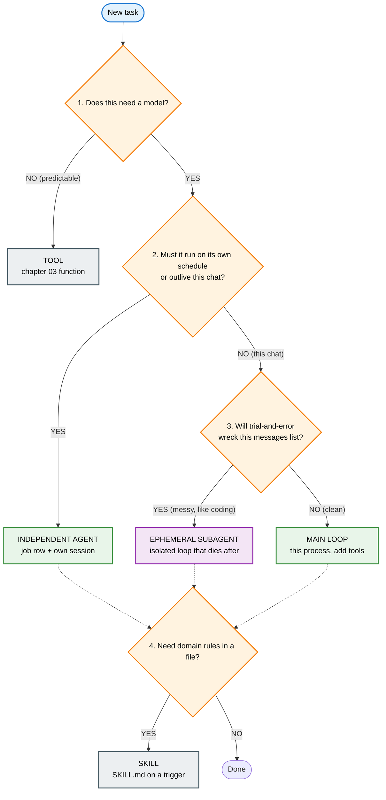

# The shape tree

Same walk as [decisions 01](../decisions/01_when_x_vs_y.md). Each leaf has two names: the word you hear, then the course object. If this page disagrees with the form, the form wins. If the form disagrees with a lab brief, the brief wins.

Read after [00_words.md](./00_words.md).

## The tree

## The leaves

| Word you hear | Course object |
|---|---|
| Tool | A function in `TOOL_REGISTRY`. [03](../../education/03_the_dispatcher/00_tool_dispatch.md) |
| Independent agent | A [18](../../education/18_the_job/00_the_job.md) job row plus its own session file ([13](../../education/13_one_agent/00_persona_tools_loop_state.md)). "Own queue" is `jobs.json`. Not a person. |
| Ephemeral subagent | An [14 wrapper](../../education/14_two_agents/03_skill_vs_two_agents.md): a child loop that returns one JSON and dies. Parent blocks. |
| Main loop | This [04](../../education/04_the_loop/00_the_react_loop.md) / [13](../../education/13_one_agent/00_persona_tools_loop_state.md) process. Add tools. |
| Skill | A [`SKILL.md`](../../education/15_mcp_and_skills/lab2_skills.md) loaded when a trigger matches. Still not a loop. |

## Not on this tree

Blast radius (Q5), park (Q7), and which host runs the loop (Q8) stay on [the form](../decisions/01_when_x_vs_y.md). Fill those after you pick a leaf.

More trees like this belong in this folder when a word still floats. Do not add one to a chapter unless that chapter already decides the split.
