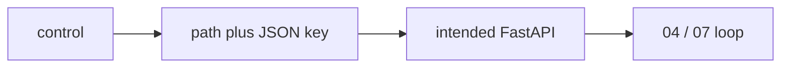

# Surface map

How a control on the page maps to a path, a JSON key, and a script. The page is a client ([10](../../education/10_the_front_door/01_frontend.md)). If this page disagrees with a lab brief, the brief wins.

You keep track by naming four things: the control, the path, the key, the script. That table is the spec. Not a Figma file. Not React.

## The map

| Control | Path | Key | Script |
|---|---|---|---|
| Send | `POST /jobs` | body `{ "prompt" }`, response `{ "job_id" }` | Starts the [04](../../education/04_the_loop/00_the_react_loop.md) / [07](../../education/07_one_agent/00_persona_tools_loop_state.md) loop |
| Stream | `GET /jobs/{job_id}/stream` | `{ "token" }` (lab 1 uses `data.delta`) | [10 lab1](../../education/10_the_front_door/lab1_sse_streaming_api.md) SSE frames |
| Stop | `WS /jobs/{job_id}/ws` | `{ "type": "interrupt" }` | [10 lab2](../../education/10_the_front_door/lab2_websocket_interrupt.md) |
| History | the session file | `session_id`, `messages` | [05](../../education/05_the_state/00_save_the_messages.md) / [07](../../education/07_one_agent/00_persona_tools_loop_state.md) `state_store`. Not drawn on the lab 3 HTML page. |
| Person text vs model text | same stream | ux vs mx | [10 lab4](../../education/10_the_front_door/lab4_mx_vs_ux.md) |

`job_id` is one run. A sidebar of past chats is a list of those session files. Lab 3 does not list them.

## Spec

A row in the table is the surface spec. [Chapter 15 spec TDD](../../education/15_synthesis/02_spec_tdd.md) is the red/green order (write a failing check, then the code). It is not Figma-to-code. Do not add a design-tool chapter for this.

Labs 1 and 2 do not start the server. The intended listener is port `8000`. Write the page against the keys above. Leave the reference `.py` files as-is.

## Later

An optional chapter can add a live FastAPI server and a React chat that lists [05](../../education/05_the_state/00_save_the_messages.md) sessions. Same keys. Same rule: the page does not own the loop. Not on the 00-18 path.
