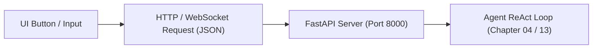

# Surface Map: Connecting User Interfaces to Backend Protocols

When building web, mobile, or terminal interfaces for an AI agent, you don't need complicated design documents or heavy frontend frameworks to specify behavior.

Instead, track the connection by naming four concrete elements:
1. **The UI Control** (e.g. a button or input field).
2. **The HTTP / WebSocket Endpoint**.
3. **The JSON Payload Keys**.
4. **The Backend Python Handler / Script**.

---

## The UI-to-Backend Protocol Map

| User Action / Control | Endpoint & Method | JSON Request / Response Keys | Backend Python Component |
|---|---|---|---|
| **Send Message** | `POST /jobs` | Request: `{"prompt": str}` Response: `{"job_id": str}` | Launches the ReAct loop ([Chapter 04](../../education/04_the_loop/00_the_react_loop.md) & [Chapter 13](../../education/13_one_agent/00_persona_tools_loop_state.md)). |
| **Stream Tokens** | `GET /jobs/{job_id}/stream` | SSE Event Payload: `{"token": str}` or `{"delta": str}` | Streams chunks via FastAPI SSE ([Chapter 19 Lab 1](../../education/19_the_front_door/lab1_sse_streaming_api.md)). |
| **Cancel / Interrupt** | `WS /jobs/{job_id}/ws` | Message: `{"type": "interrupt"}` | WebSocket interrupt handler ([Chapter 19 Lab 2](../../education/19_the_front_door/lab2_websocket_interrupt.md)). |
| **View History** | File / Database Read | Session Data: `session_id`, `messages` array | Checkpoint state store ([Chapter 07](../../education/07_the_state/00_save_the_messages.md) & [Chapter 13](../../education/13_one_agent/00_persona_tools_loop_state.md)). |
| **Filter Model vs User Text** | Stream Parser | Separates `ux` (user text) from `mx` (internal model thoughts) | Demuxing filter ([Chapter 19 Lab 4](../../education/19_the_front_door/lab4_mx_vs_ux.md)). |

---

## Architectural Principles

- **The frontend does not execute the agent loop**: The browser or mobile app simply displays streaming tokens and sends user events.
- **State lives on the backend**: The conversation history and tool permissions remain safely inside your Python server.
- **Specification-Driven Development**: In [Chapter 20 Spec TDD](../../education/20_synthesis/02_spec_tdd.md), you write automated tests verifying these exact JSON payloads before writing the backend code.

