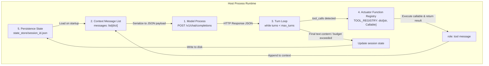

# The Anatomy of an AI Agent

In modern software development, AI agents are often described using buzzwords like *"autonomous digital workers"* or *"synthetic intelligence."* In reality, an AI agent is simply a straightforward Python program that runs a bounded loop, sends messages to an AI model, executes local functions when asked, and saves its progress to disk.

When you look under the hood, every agent runtime is made up of five practical building blocks working together.

---

## The 5 Concrete Architectural Components



### 1. The Model Process (Inference Engine)
The model is an external or local HTTP server process hosting frozen neural network weights (such as Ollama on `http://127.0.0.1:11434` or a cloud API endpoint).
- **Protocol**: Standard HTTP `POST` transmitting a JSON body containing `model`, `messages`, `tools`, and `temperature`.
- **Input**: An array of message dictionaries containing `role`, `content`, and optional `tool_calls` or `tool_call_id`.
- **Output**: A JSON response containing a completion message (`role: "assistant"`, `content: str`, and optional `tool_calls: list[dict]`).
- **Nature**: A stateless function that predicts the next tokens. The model process retains zero memory across HTTP requests unless previous conversation turns are included in the `messages` array.

### 2. The Context Message List (Working Memory)
An append-only in-memory list of standard dictionaries representing the dialogue history and tool interactions:
```python
messages: list[dict[str, any]] = [
    {"role": "system", "content": "You are a literal file utility agent."},
    {"role": "user", "content": "Count lines in data.txt"},
    {
        "role": "assistant",
        "content": None,
        "tool_calls": [
            {
                "id": "call_001",
                "type": "function",
                "function": {"name": "count_lines", "arguments": "{\"path\": \"data.txt\"}"}
            }
        ]
    },
    {"role": "tool", "tool_call_id": "call_001", "content": "{\"lines\": 42}"},
    {"role": "assistant", "content": "data.txt contains 42 lines."}
]
```

### 3. The Turn Loop (The Control Kernel)
A deterministic `while` loop evaluated by the host interpreter. The turn loop manages:
1. Turn budget decrement (`turn_counter += 1`, checking against `max_turns`).
2. HTTP request construction and transmission to the Model Process.
3. Response inspection:
   - If `tool_calls` is present: iterate over calls, look up function pointers, execute them with parsed JSON arguments, append `role: tool` messages, and continue the loop.
   - If `content` text is returned without `tool_calls`: yield the response and exit the loop.
   - If budget is exceeded: terminate with an error status.

### 4. The Actuator Function Registry (Tool Interface)
A lookup table mapping string identifiers to callable Python functions, paired with an OpenAI-compatible JSON schema list:
```python
TOOL_REGISTRY: dict[str, callable] = {
    "count_lines": count_lines_function,
    "read_file": read_file_function
}

TOOLS_SCHEMA: list[dict] = [
    {
        "type": "function",
        "function": {
            "name": "count_lines",
            "description": "Count newline characters in a file",
            "parameters": {
                "type": "object",
                "properties": {"path": {"type": "string"}},
                "required": ["path"]
            }
        }
    }
]
```

### 5. The Persistence State (Storage Interface)
A file on disk (typically JSON or SQLite) storing the context message history, cumulative token consumption, session identifiers, and execution status across process invocations:
```
state_store/
└── session_8f9c12b.json
```

---

## 1. Data Contracts

### Agent Configuration Contract (`agent_config.json`)
The immutable configuration specifying runtime parameters for the agent process:

```json
{
  "$schema": "http://json-schema.org/draft-07/schema#",
  "title": "AgentConfiguration",
  "type": "object",
  "required": ["agent_id", "model", "system_prompt", "max_turns", "state_path"],
  "properties": {
    "agent_id": {
      "type": "string",
      "description": "Unique alphanumeric identifier for this agent instance"
    },
    "model": {
      "type": "string",
      "description": "Target model name served at provider endpoint"
    },
    "provider_url": {
      "type": "string",
      "format": "uri",
      "default": "http://127.0.0.1:11434/v1/chat/completions"
    },
    "system_prompt": {
      "type": "string",
      "description": "Base instructions injected at index 0 of the context list"
    },
    "max_turns": {
      "type": "integer",
      "minimum": 1,
      "maximum": 100,
      "default": 10
    },
    "temperature": {
      "type": "number",
      "minimum": 0.0,
      "maximum": 2.0,
      "default": 0.0
    },
    "timeout_seconds": {
      "type": "integer",
      "default": 60
    },
    "state_path": {
      "type": "string",
      "description": "Relative or absolute path for state JSON persistence"
    }
  }
}
```

### Turn Payload Contract (HTTP Wire Level)
The exact wire payload exchanged with the model process on every turn:

```json
{
  "model": "llama3.2:1b",
  "temperature": 0.0,
  "messages": [
    {
      "role": "system",
      "content": "You are a literal file utility agent."
    },
    {
      "role": "user",
      "content": "Check if log.txt exists."
    }
  ],
  "tools": [
    {
      "type": "function",
      "function": {
        "name": "file_exists",
        "description": "Check file presence on disk",
        "parameters": {
          "type": "object",
          "properties": {
            "path": {"type": "string"}
          },
          "required": ["path"]
        }
      }
    }
  ],
  "tool_choice": "auto"
}
```

### Session State Contract (`state_store/session_{id}.json`)
The on-disk structure capturing execution metadata and message history across turns:

```json
{
  "session_id": "sess_20260821_a1b2",
  "agent_id": "file_audit_agent",
  "created_at": "2026-08-21T10:00:00Z",
  "updated_at": "2026-08-21T10:00:15Z",
  "turn_counter": 2,
  "total_tokens_consumed": 482,
  "status": "completed",
  "messages": [
    {"role": "system", "content": "You are a literal file utility agent."},
    {"role": "user", "content": "Check if log.txt exists."},
    {
      "role": "assistant",
      "content": null,
      "tool_calls": [
        {
          "id": "call_01",
          "type": "function",
          "function": {"name": "file_exists", "arguments": "{\"path\": \"log.txt\"}"}
        }
      ]
    },
    {"role": "tool", "tool_call_id": "call_01", "content": "{\"exists\": true, \"size_bytes\": 1024}"},
    {"role": "assistant", "content": "The file log.txt exists and is 1,024 bytes."}
  ]
}
```

---

## 2. State Machine Transition Table

The execution state of an agent kernel is deterministic and governed by the following transitions:

| Current State | Event / Trigger | Guard / Precondition | Next State | Action / Side Effect |
|---|---|---|---|---|
| `IDLE` | `receive_user_prompt(text)` | Context initialized | `MODEL_INFERENCE` | Append `role: user` message to `messages`; reset `turn_counter = 0`. |
| `MODEL_INFERENCE` | `http_response_received` | `tool_calls` present in payload & `turn_counter < max_turns` | `TOOL_EXECUTION` | Append assistant message with `tool_calls` to `messages`; increment `turn_counter`. |
| `MODEL_INFERENCE` | `http_response_received` | `tool_calls` is empty/null & `content` is string | `STATE_PERSISTENCE` | Append assistant message with `content` to `messages`. |
| `MODEL_INFERENCE` | `http_error` or `timeout` | Retry count `< max_retries` | `MODEL_INFERENCE` | Exponential backoff sleep; retry HTTP request. |
| `MODEL_INFERENCE` | `turn_limit_reached` | `turn_counter >= max_turns` | `STATE_PERSISTENCE` | Append system warning message regarding budget exhaustion. |
| `TOOL_EXECUTION` | `functions_executed` | All tool call IDs resolved | `MODEL_INFERENCE` | Append `role: tool` messages with return JSON string to `messages`. |
| `TOOL_EXECUTION` | `function_exception` | Target function threw unhandled error | `MODEL_INFERENCE` | Wrap exception traceback in JSON string; append as `role: tool` error output. |
| `STATE_PERSISTENCE` | `disk_write_complete` | File lock acquired | `TERMINATED` | Write updated `messages`, token counts, and final status to `state_path`. |
| `TERMINATED` | `session_closed` | None | `IDLE` | Return final assistant content string to caller; wait for next user invocation. |

---

## 3. Negative Boundaries: What an Agent is NOT

To eliminate common architectural misconceptions:

1. **An agent is NOT a consciousness or self-aware entity.**
   It is a standard Python program executing synchronous or asynchronous function calls driven by conditional branching on JSON strings.
2. **An agent is NOT an unconstrained self-modifying neural network.**
   The neural network weights are static, read-only floating point arrays stored on disk. The agent "learns" nothing permanently during execution; "learning" is merely appending text to the temporary context list.
3. **An agent is NOT an infinite autonomous daemon by default.**
   Without an explicit outer job queue or supervisor loop, an agent terminates as soon as the current turn loop reaches a text completion or hits `max_turns`.
4. **An agent is NOT a replacement for deterministic code.**
   If a task can be solved with a 10-line Python script or regular expression, wrapping it in an LLM agent introduces non-determinism, 1000x latency, and token cost without benefit.
5. **An agent is NOT a database.**
   Context stored in `messages` is bounded by the context window limit (`n_ctx`). Long-term persistence requires explicit file I/O.
6. **An agent is NOT a framework dependency.**
   An agent does not require thousands of lines of third-party abstractions; it can be implemented completely using the Python standard library.

---

## 4. Concrete Step Walkthrough: Execution Trace

Below is a deterministic trace of an agent executing the prompt: *"Calculate the MD5 hash of notes.txt"*.

```
[TURN 0: INITIALIZATION]
1. Host process loads agent_config.json.
2. Host initializes messages = [
     {"role": "system", "content": "You are a literal utility agent. Use tools to inspect files."}
   ]
3. User prompt arrives: "Calculate the MD5 hash of notes.txt"
4. messages.append({"role": "user", "content": "Calculate the MD5 hash of notes.txt"})
5. turn_counter = 0, max_turns = 5.

[TURN 1: INFERENCE & DISPATCH]
6. State -> MODEL_INFERENCE:
   Host transmits POST request to http://127.0.0.1:11434/v1/chat/completions with messages and TOOLS_SCHEMA.
7. Model evaluates token sequence and returns HTTP 200:
   {
     "choices": [{
       "message": {
         "role": "assistant",
         "content": null,
         "tool_calls": [{
           "id": "call_md5_01",
           "type": "function",
           "function": {
             "name": "compute_file_hash",
             "arguments": "{\"path\": \"notes.txt\", \"algorithm\": \"md5\"}"
           }
         }]
       }
     }]
   }
8. State -> TOOL_EXECUTION:
   - Host appends assistant tool_calls message to messages.
   - Host parses JSON arguments: {"path": "notes.txt", "algorithm": "md5"}.
   - Host looks up 'compute_file_hash' in TOOL_REGISTRY.
   - Host executes: compute_file_hash(path="notes.txt", algorithm="md5").
   - Function reads notes.txt, calculates hashlib.md5, returns: {"hash": "d41d8cd98f00b204e9800998ecf8427e"}.
9. Host appends tool message:
   {
     "role": "tool",
     "tool_call_id": "call_md5_01",
     "content": "{\"hash\": \"d41d8cd98f00b204e9800998ecf8427e\"}"
   }
10. turn_counter becomes 1 (1 < 5).

[TURN 2: FINAL COMPLETION & PERSISTENCE]
11. State -> MODEL_INFERENCE:
    Host transmits POST request with updated messages array (now containing system, user, assistant tool_call, and tool result).
12. Model evaluates sequence and returns HTTP 200:
    {
      "choices": [{
        "message": {
          "role": "assistant",
          "content": "The MD5 hash of notes.txt is d41d8cd98f00b204e9800998ecf8427e.",
          "tool_calls": null
        }
      }]
    }
13. Host detects tool_calls is None; appends final assistant message to messages.
14. State -> STATE_PERSISTENCE:
    Host writes entire messages list and execution metadata to state_store/session_001.json.
15. State -> TERMINATED:
    Host outputs text to stdout and closes turn loop.
```

---

## Pure Standard Library Implementation Reference

In pure standard library Python, an agent kernel requires zero external dependencies:

```python
import json
import urllib.request
import pathlib

def run_agent_turn_loop(
    user_prompt: str,
    system_prompt: str,
    tools_schema: list[dict],
    tool_registry: dict[str, callable],
    model: str = "llama3.2:1b",
    endpoint: str = "http://127.0.0.1:11434/v1/chat/completions",
    state_path: str = "state_store/session.json",
    max_turns: int = 5
) -> str:
    messages = [
        {"role": "system", "content": system_prompt},
        {"role": "user", "content": user_prompt}
    ]
    
    for _ in range(max_turns):
        payload = {
            "model": model,
            "messages": messages,
            "tools": tools_schema,
            "temperature": 0.0
        }
        req = urllib.request.Request(
            endpoint,
            data=json.dumps(payload).encode("utf-8"),
            headers={"Content-Type": "application/json"}
        )
        with urllib.request.urlopen(req) as resp:
            data = json.loads(resp.read().decode("utf-8"))
            
        choice = data["choices"][0]["message"]
        messages.append(choice)
        
        tool_calls = choice.get("tool_calls")
        if not tool_calls:
            # Final text response
            pathlib.Path(state_path).parent.mkdir(parents=True, exist_ok=True)
            pathlib.Path(state_path).write_text(json.dumps(messages, indent=2), encoding="utf-8")
            return choice.get("content", "")
            
        for call in tool_calls:
            fn_name = call["function"]["name"]
            fn_args = json.loads(call["function"]["arguments"])
            fn_callable = tool_registry[fn_name]
            result = fn_callable(**fn_args)
            messages.append({
                "role": "tool",
                "tool_call_id": call["id"],
                "content": json.dumps(result)
            })
            
    raise RuntimeError("Agent exceeded maximum turn budget")
```

---

## Related Course Modules

- [00_atoms](../../education/00_atoms/00_script_provider_weights.md): The script, the provider, and the weight file.
- [01_the_call](../../education/01_the_call/00_the_wrapper_and_the_stream.md): The raw HTTP request and response wire protocol.
- [02_the_contract](../../education/02_the_contract/00_messages_and_json.md): Message arrays, roles, and JSON serialization.
- [03_the_dispatcher](../../education/03_the_dispatcher/00_tool_dispatch.md): Tool registries and function dispatching.
- [04_the_loop](../../education/04_the_loop/00_the_react_loop.md): The ReAct while loop evaluation.
- [07_the_state](../../education/07_the_state/00_save_the_messages.md): Session persistence to disk.
- [13_one_agent](../../education/13_one_agent/00_persona_tools_loop_state.md): Synthesis into a single unified agent class.

