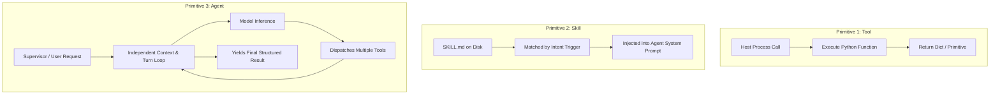
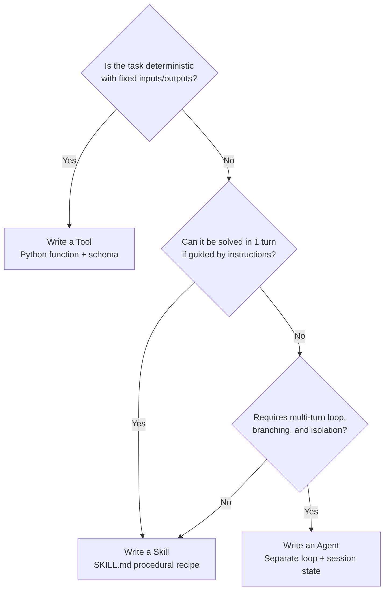

# Concrete Boundaries: Tool vs Skill vs Agent

In AI systems development, the terms **Tool**, **Skill**, and **Agent** are frequently conflated. Framework marketing treats them as interchangeable levels of "smartness". In systems engineering, they are three distinct architectural primitives with fundamentally different runtime footprints, execution engines, state lifecycles, and interface contracts.

Conflating these primitives leads to bloated context windows, unbounded latency, and brittle orchestration graphs.

---

## 1. The Comparative Matrix

| Dimension | Tool | Skill | Agent |
|---|---|---|---|
| **Literal Nature** | A deterministic function pointer paired with a JSON schema descriptor. | A structured text recipe (`SKILL.md`) or a composite wrapper script. | An independent execution process running a bounded `while` turn loop. |
| **Execution Engine** | Host Python runtime (synchronous / asynchronous function call). | Model prompt processor (interprets text guidelines) or child script wrapper. | Autonomous Turn Loop calling Model Process + Actuator Registry. |
| **State Lifecycle** | Ephemeral: executes in milliseconds, retains no internal memory across calls. | Invariant: static markdown loaded into context on demand, or cached in prompt. | Stateful: manages an append-only `messages` array and writes to `state_store/session.json`. |
| **Context Impact** | Low: consumes ~50–150 tokens in `tools` schema parameter. | Medium: consumes ~500–2,000 tokens when injected into working context. | High / Isolated: owns its own independent context window; zero leakage to caller. |
| **Failure Handling** | Returns error JSON or raises Python exception back to caller. | Model self-corrects via prompt instructions or fails silently. | Evaluates error, triggers Reflexion / Replanning, or escalates to supervisor. |
| **Autonomy Level** | Zero: strictly passive, executes only when directly invoked with exact arguments. | Low / Guided: provides procedural constraints to direct model behavior. | High: decides which tools to invoke, sequences steps, and determines when done. |
| **Transport / Wire** | In-process Python function call or local IPC. | File read (`pathlib.Path.read_text()`) injected into `system` or `user` message. | HTTP REST API, Unix domain socket, or stdio message protocol. |
| **Scope** | Single atomic operation (e.g., read file, execute SQL, compute hash). | Standard Operating Procedure (e.g., how to diagnose a network timeout). | End-to-end goal pursuit (e.g., resolve customer incident #482). |

---

## 2. Deep Dive on Architectural Primitives



### The Tool (Atomic Actuator)
A tool is a standard Python function made visible to the model via a JSON Schema descriptor.
- It performs **one deterministic action**.
- It does not contain an LLM call inside itself (unless designed as a recursive subagent wrapper).
- It runs inside the host process and returns structured data (strings, numbers, dictionaries).

### The Skill (Procedural Recipe)
A skill is a structured markdown document (`SKILL.md`) providing domain instructions, tool invocation sequences, and validation checklists.
- It is **passive knowledge** loaded into context when relevant.
- It standardizes complex workflows without requiring hardcoded application logic.
- A skill can also take the form of a **skill wrapper tool**—a convenience function that executes a predefined series of operations and returns a single combined summary to save context tokens.

### The Agent (Autonomous Kernel)
An agent is an isolated runtime process with its own system prompt, context list (`messages`), actuator registry, and session persistence file (`session.json`).
- It has **agency over multiple turns**: it evaluates model completions, decides next actions, recovers from errors, and determines when the goal is achieved.
- Agents communicate with other agents via formal message passing (Handoff Protocol).

---

## 3. Data Contracts

### A. Tool Contract (`tool_schema.json`)
The OpenAI-compatible JSON Schema defining function name, description, and strict parameter typing:

```json
{
  "type": "function",
  "function": {
    "name": "query_database",
    "description": "Execute a read-only SQL query against the metrics database",
    "parameters": {
      "type": "object",
      "properties": {
        "query": {
          "type": "string",
          "description": "The SQL query string (SELECT statements only)"
        },
        "timeout_ms": {
          "type": "integer",
          "default": 5000
        }
      },
      "required": ["query"]
    }
  }
}
```

### B. Skill Contract (`SKILL.md` Frontmatter & Structure)
A structured document with YAML frontmatter defining triggers, required tools, and execution rules:

```yaml
---
name: database_incident_triage
version: "1.0.0"
description: "Standard operating procedure for triaging database connection pool exhaustion"
triggers:
  - "connection pool exhausted"
  - "database timeout error"
prerequisites:
  tools:
    - "query_database"
    - "restart_service"
---

# Database Incident Triage Procedure

## 1. Verification
1. Run `query_database` with `SELECT count(*) FROM pg_stat_activity WHERE state = 'active';`.
2. If active connections > 95% of max_connections, proceed to diagnosis.

## 2. Root Cause Analysis
1. Identify longest-running queries:
   `SELECT pid, now() - query_start AS duration, query FROM pg_stat_activity WHERE state != 'idle' ORDER BY 2 DESC LIMIT 5;`
2. If a blocking query exceeds 300 seconds, terminate the backend PID.

## 3. Escalation
- If connections remain exhausted after PID termination, invoke the supervisor agent for restart approval.
```

### C. Agent Handoff Contract (`handoff_payload.json`)
The wire format used when a supervisor agent delegates a task to an autonomous worker agent:

```json
{
  "protocol_version": "1.0",
  "handoff_id": "hnd_8912-4f1a",
  "source_agent_id": "supervisor_agent",
  "target_agent_id": "database_triage_worker",
  "task": {
    "task_id": "task_20260821_01",
    "goal": "Triage and resolve database connection spike on cluster db-primary-01",
    "budget": {
      "max_turns": 8,
      "timeout_seconds": 120
    },
    "context_slice": [
      {"role": "system", "content": "Alert: db-primary-01 active connections at 98% capacity."}
    ]
  },
  "return_channel": {
    "type": "file_ipc",
    "path": "state_store/handoffs/hnd_8912-4f1a_result.json"
  }
}
```

---

## 4. State Machine Transition Tables (Lifecycle Comparison)

The fundamental difference between Tools, Skills, and Agents is visible in their state transition models:

### A. Tool Lifecycle State Machine
A Tool is stateless and synchronous. It undergoes a direct, non-branching transition:

| Current State | Event / Trigger | Next State | Action / Output |
|---|---|---|---|
| `UNINITIALIZED` | Host invokes function with parameters | `EXECUTING` | Runs deterministic Python function code |
| `EXECUTING` | Execution succeeds | `TERMINATED` | Returns output dictionary / primitive to caller |
| `EXECUTING` | Uncaught runtime error occurs | `FAILED` | Raises Python exception or returns error dict |

### B. Skill Lifecycle State Machine
A Skill is static procedural knowledge loaded into context:

| Current State | Event / Trigger | Next State | Action / Output |
|---|---|---|---|
| `ON_DISK` | Intent classifier matches trigger rule | `RESOLVED` | Locates `SKILL.md` path on local filesystem |
| `RESOLVED` | Agent prepares prompt context | `INJECTED` | Reads markdown body and prepends to prompt |
| `INJECTED` | Turn completes or context compacts | `EVICTED` | Unloads skill text from active memory if inactive |

### C. Agent Lifecycle State Machine
An Agent is a stateful autonomous loop managing persistent state across turns:

| Current State | Event / Trigger | Next State | Action / Output |
|---|---|---|---|
| `INIT` | User / Parent dispatch arrives | `HYDRATING` | Loads `session.json` and tool schemas |
| `HYDRATING` | State restored | `CALL_MODEL` | Sends payload to provider endpoint |
| `CALL_MODEL` | Model emits `tool_calls` | `DISPATCH_TOOLS` | Executes matching tools in actuator registry |
| `DISPATCH_TOOLS` | Tool results appended to messages | `CALL_MODEL` | Increments turn counter; repeats loop |
| `CALL_MODEL` | Model emits text (no `tool_calls`) | `COMPLETED` | Persists state and returns final output |
| `CALL_MODEL` / `DISPATCH_TOOLS` | Turn counter > budget or error | `FAILED` | Emits error report; escalates to supervisor |

---

## 5. Negative Boundaries: Eliminating Category Errors

1. **A Tool is NOT an Agent.**
   A function like `read_file(path)` cannot decide when to invoke itself, cannot retry upon bad parameters without caller intervention, and has no internal memory.
2. **A Skill is NOT a Running Process.**
   A `SKILL.md` file sitting in a directory does nothing on its own. It requires an agent process to read it into context and execute the tools described within it.
3. **An Agent is NOT Just a Prompt Template.**
   A system prompt that says *"You are an autonomous researcher"* is not an agent. It is just a prompt string until it is wired into a `while` turn loop with an actuator function registry and session persistence.
4. **A Wrapper Tool is NOT a Full Agent.**
   A Python function that makes a single hardcoded LLM call to summarize a string is a Tool, not an Agent. It lacks a dynamic multi-turn control loop and tool dispatch registry.
5. **Adding More Tools Does NOT Make an Agent Smarter.**
   Providing 50 tools to a single agent increases prompt token overhead and causes tool selection hallucinations. Complex workflows should be broken into Skills or delegated to specialized Agents.

---

## 6. Step Walkthrough: One Problem Solved via Three Modalities

### The Engineering Problem
*\"Inspect `/var/log/auth.log` and identify IP addresses with more than 5 failed SSH login attempts in the past hour.\"*

---

### Modality A: Solved as a Tool
The host application calls a single deterministic Python function.

```python
# Pure deterministic execution: 2ms runtime, 0 LLM tokens consumed
def audit_failed_logins(log_path: str = "/var/log/auth.log", threshold: int = 5) -> dict[str, int]:
    import re
    from collections import Counter
    
    ip_pattern = re.compile(r"Failed password for .* from (\d+\.\d+\.\d+\.\d+) port")
    failed_ips = Counter()
    
    with open(log_path, "r", encoding="utf-8") as f:
        for line in f:
            match = ip_pattern.search(line)
            if match:
                failed_ips[match.group(1)] += 1
                
    return {ip: count for ip, count in failed_ips.items() if count >= threshold}
```
- **When to use**: When the log format is fixed, requirements are fully specified, and zero reasoning or fuzzy interpretation is required.

---

### Modality B: Solved as a Skill
A general-purpose agent is loaded with a `log_analysis_skill.md` procedural recipe.

```
[EXECUTION SEQUENCE]
1. Host loads log_analysis_skill.md into general_utility_agent context.
2. Skill provides procedure:
   a. Check if log file is compressed (.gz) or plaintext.
   b. Use `grep_file` tool to search for pattern 'Failed password'.
   c. Use `execute_python` tool to count occurrences per IP.
   d. Format output as markdown table.
3. Agent reads instructions, executes grep_file("auth.log", "Failed password"), parses result, and formats response.
```
- **When to use**: When the agent possesses generic tools (`read_file`, `grep`, `run_python`) and needs structured domain instructions to perform non-standard analysis across varying file formats.

---

### Modality C: Solved as an Agent
A primary Supervisor Agent delegates the entire investigation to an autonomous `SecurityAuditAgent`.

```
[EXECUTION SEQUENCE]
1. Supervisor creates handoff payload with goal: "Identify malicious authentication traffic and check firewall rules".
2. SecurityAuditAgent spawns in separate process / session.
3. Turn 1: Worker invokes `audit_failed_logins` tool -> returns {"203.0.113.19": 142}.
4. Turn 2: Worker invokes `check_iptables(ip="203.0.113.19")` -> discovers IP is NOT blocked.
5. Turn 3: Worker invokes `generate_firewall_rule(ip="203.0.113.19", action="DROP")`.
6. Turn 4: Worker persists session state, generates structured Incident Report JSON, and sends completion message to Supervisor.
```
- **When to use**: When the task requires multi-turn investigation, branching decisions based on intermediate findings, and cross-system tool interactions.

---

## 7. Architectural Decision Heuristic



### Summary Rules
1. **Default to a Tool** whenever logic can be expressed in deterministic code.
2. **Default to a Skill** when an existing agent needs domain guidance without changing its code.
3. **Graduate to an Agent** only when the task demands an independent turn loop, isolated context, and multi-step error recovery.

---

## Related Course Modules

- [03_the_dispatcher](../../education/03_the_dispatcher/00_tool_dispatch.md): Implementing tools and the function dispatcher.
- [04_the_loop](../../education/04_the_loop/00_the_react_loop.md): Building the autonomous turn loop.
- [14_two_agents](../../education/14_two_agents/00_topologies.md): Multi-agent architectures and handoff protocols.
- [15_mcp_and_skills](../../education/15_mcp_and_skills/00_mcp_overview.md): Markdown skill loading and protocol standardization.

