# Planning, ReAct, and Reflexion at the Code and State Level

When language models attempt complex, multi-step engineering tasks, zero-shot generation frequently fails due to compounding errors, context drift, and tool execution failures. To overcome these limitations, three primary control architectures have emerged:

1. **ReAct** (Reason + Act: greedy, step-by-step reaction)
2. **Plan-and-Solve / Task Decomposition** (upfront structured planning with dependency tracking)
3. **Reflexion** (evaluator-guided self-critique and trial-and-error retry loops)

This document breaks down each pattern to its literal code, data structures, state machine transitions, and memory transformations.

---

## 1. Architectural Deconstruction

```mermaid
flowchart TD
    subgraph ReAct ["1. ReAct: Greedy Local Loop"]
        R_P["Prompt"] --> R_M["Model: Thought + Action"]
        R_M --> R_T["Tool Execution: Observation"]
        R_T -->|"Append Observation"| R_M
    end

    subgraph PlanAndSolve ["2. Plan-and-Solve: Structured Decomposition"]
        PS_G["Goal"] --> PS_P["Model Generates Plan JSON"]
        PS_P --> PS_E["Step Iterator"]
        PS_E --> PS_T["Execute Step Tool"]
        PS_T -->|"Success"| PS_E
        PS_T -->|"Failure"| PS_R["Replan Mutation"]
        PS_R --> PS_E
    end

    subgraph Reflexion ["3. Reflexion: Evaluator & Critique Loop"]
        RF_A["Actor Attempt"] --> RF_EV["Evaluator Verification"]
        RF_EV -->|"Pass"| RF_OK["Success"]
        RF_EV -->|"Fail"| RF_CR["Reflexion Critique Generator"]
        RF_CR -->|"Store Critique in Episodic Memory"| RF_MEM["Context Augmentation"]
        RF_MEM -->|"Retry Attempt"| RF_A
    end
```



### A. ReAct (Reason + Act)
ReAct interleaves reasoning tokens and tool invocations within a single continuous `while` loop.
- **Mechanism**: The model outputs a `thought` string explaining its logic, immediately followed by one or more `tool_calls`. The host executes the tools, appends `role: tool` observations, and immediately returns execution to the model.
- **State Shape**: A linear, unstructured `messages: list[dict]` array.
- **Strengths**: Reactive to unexpected immediate tool outputs; minimal upfront orchestration complexity.
- **Weaknesses**: Myopic (greedy local choices); prone to infinite loops when tools return repeated errors; loses global goal orientation on long horizons.

### B. Plan-and-Solve (Task Decomposition)
Plan-and-Solve decouples **strategy generation** from **step execution**.
- **Mechanism**:
  1. *Planning Phase*: The model receives the overall goal and available tools, emitting a strictly typed `ExecutionPlan` JSON object (an array of explicit subtasks).
  2. *Execution Phase*: A deterministic loop executes steps sequentially, injecting intermediate outputs into subsequent steps.
  3. *Replanning Phase*: If an intermediate step fails, a replanning prompt receives the failed step, error traceback, and remaining steps, emitting a mutated `ExecutionPlan`.
- **State Shape**: A structured dictionary holding `plan_id`, `steps`, `status`, and `results`.
- **Strengths**: Highly auditable, predictable token consumption, transparent progress tracking.
- **Weaknesses**: Upfront plan may be invalid if the environment state is unknown prior to step 1.

### C. Reflexion (Verbal Reinforcement Learning)
Reflexion wraps execution in an Actor-Evaluator-Critique loop.
- **Mechanism**:
  1. *Actor*: Generates a candidate solution or executes a complex task sequence.
  2. *Evaluator*: A deterministic unit test, regex assertion, schema validator, or secondary evaluation prompt verifies the outcome.
  3. *Critique*: Upon failure, a specialized prompt analyzes the error and produces a natural language diagnosis (the *verbal critique*).
  4. *Memory Integration*: The critique is persisted to episodic memory and prepended to the Actor's next prompt turn as a negative constraint.
- **State Shape**: `messages` list augmented with an array of historical critique strings.
- **Strengths**: Drastically increases success rates on complex reasoning, coding, and API orchestration tasks without model fine-tuning.
- **Weaknesses**: Increases token cost linearly with each retry attempt; requires reliable evaluator assertions.

---

## 2. Data Contracts

### A. Execution Plan Contract (`execution_plan.json`)
The structured payload generated and mutated during Plan-and-Solve workflows:

```json
{
  "$schema": "http://json-schema.org/draft-07/schema#",
  "title": "ExecutionPlan",
  "type": "object",
  "required": ["plan_id", "goal", "status", "steps", "replan_count"],
  "properties": {
    "plan_id": {"type": "string"},
    "goal": {"type": "string"},
    "status": {
      "type": "string",
      "enum": ["pending", "executing", "completed", "failed", "replanned"]
    },
    "replan_count": {"type": "integer", "default": 0},
    "max_replans": {"type": "integer", "default": 3},
    "steps": {
      "type": "array",
      "items": {
        "type": "object",
        "required": ["step_id", "description", "tool_name", "tool_args", "status"],
        "properties": {
          "step_id": {"type": "integer"},
          "description": {"type": "string"},
          "tool_name": {"type": "string"},
          "tool_args": {"type": "object"},
          "dependencies": {
            "type": "array",
            "items": {"type": "integer"}
          },
          "status": {
            "type": "string",
            "enum": ["pending", "in_progress", "completed", "failed", "skipped"]
          },
          "result": {"type": ["object", "string", "number", "boolean", "null"]},
          "error": {"type": ["string", "null"]}
        }
      }
    }
  }
}
```

### B. Reflexion Evaluation Contract (`reflexion_eval.json`)
The evaluation record capturing test outcomes and generated critique:

```json
{
  "$schema": "http://json-schema.org/draft-07/schema#",
  "title": "ReflexionEvaluation",
  "type": "object",
  "required": ["eval_id", "attempt_number", "status", "critique"],
  "properties": {
    "eval_id": {"type": "string"},
    "attempt_number": {"type": "integer"},
    "status": {
      "type": "string",
      "enum": ["passed", "failed"]
    },
    "test_results": {
      "type": "array",
      "items": {
        "type": "object",
        "properties": {
          "assertion_name": {"type": "string"},
          "passed": {"type": "boolean"},
          "observed_output": {"type": "string"}
        },
        "required": ["assertion_name", "passed"]
      }
    },
    "critique": {
      "type": "string",
      "description": "Verbal diagnosis explaining why the attempt failed and how to prevent it on the next turn"
    },
    "suggested_correction": {
      "type": "string",
      "description": "Concrete action directive for the next attempt"
    }
  }
}
```

---

## 3. State Machine Transition Tables

### Plan-and-Solve State Machine

| Current State | Event / Trigger | Guard / Precondition | Next State | Action / Side Effect |
|---|---|---|---|---|
| `PLAN_GENERATION` | `goal_received` | Valid tool definitions provided | `STEP_SELECTION` | Model outputs `ExecutionPlan` JSON; write plan to memory. |
| `STEP_SELECTION` | `next_step_requested` | Unexecuted steps exist & dependencies satisfied | `STEP_EXECUTION` | Mark `steps[i].status = 'in_progress'`. |
| `STEP_SELECTION` | `all_steps_done` | All step statuses == `'completed'` | `PLAN_COMPLETED` | Return aggregate step results to caller. |
| `STEP_EXECUTION` | `tool_success` | Tool returned valid JSON result | `STEP_SELECTION` | Mark `steps[i].status = 'completed'`; store `result`. |
| `STEP_EXECUTION` | `tool_error` | Tool threw exception or returned error payload | `RESULT_EVALUATION` | Mark `steps[i].status = 'failed'`; store `error`. |
| `RESULT_EVALUATION` | `evaluate_failure` | `replan_count < max_replans` | `DYNAMIC_REPLANNING` | Increment `replan_count`; compile failed step context. |
| `RESULT_EVALUATION` | `evaluate_failure` | `replan_count >= max_replans` | `PLAN_FAILED` | Terminate workflow with unrecoverable failure status. |
| `DYNAMIC_REPLANNING` | `replan_emitted` | Model returned valid mutated plan JSON | `STEP_SELECTION` | Overwrite remaining pending steps; resume iteration. |

---

### Reflexion State Machine

| Current State | Event / Trigger | Guard / Precondition | Next State | Action / Side Effect |
|---|---|---|---|---|
| `INITIAL_ATTEMPT` | `task_started` | Attempt counter == 1 | `EVALUATION_CHECK` | Actor executes candidate logic / tool sequence. |
| `EVALUATION_CHECK` | `tests_evaluated` | All verification assertions passed | `TERMINAL_SUCCESS` | Yield final artifact and exit loop. |
| `EVALUATION_CHECK` | `tests_evaluated` | One or more assertions failed & `attempt < max_attempts` | `CRITIQUE_GENERATION` | Package test failure diffs and execution logs. |
| `EVALUATION_CHECK` | `tests_evaluated` | One or more assertions failed & `attempt >= max_attempts` | `EXHAUSTED_RETRIES` | Terminate and return best-effort artifact with failure logs. |
| `CRITIQUE_GENERATION` | `critique_produced` | Non-empty critique string received from model | `CONTEXT_AUGMENTATION` | Append critique to episodic memory store. |
| `CONTEXT_AUGMENTATION`| `prompt_rebuilt` | Critique injected into system/user message | `RETRY_ATTEMPT` | Increment `attempt_counter += 1`. |
| `RETRY_ATTEMPT` | `execute_retry` | None | `EVALUATION_CHECK` | Actor executes with augmented context. |

---

## 4. Negative Boundaries: What Planning and Reflection are NOT

1. **Planning is NOT Human Foresight or Conscious Deliberation.**
   Planning is an LLM token generation pass constrained by a JSON schema that outputs an array of strings. It possesses no secret forward simulation unless explicitly combined with a deterministic simulator or search tree.
2. **Reflection is NOT Machine Self-Awareness or Introspection.**
   Reflection is string concatenation. It consists of taking stdout/stderr error text, asking the model to summarize what went wrong into a critique string, and prepending that string to the next prompt.
3. **ReAct is NOT an External Framework Dependency.**
   ReAct is simply a 30-line `while` loop that inspects the `tool_calls` key on an HTTP response dict and loops until the model outputs text.
4. **Replanning is NOT Restarting from Scratch.**
   Replanning mutates only the unexecuted tail of an `ExecutionPlan`. Steps already completed successfully are preserved in the state record.

---

## 5. Concrete Step Walkthrough: Error Recovery via Reflexion & Replanning

### The Scenario
**Goal**: *"Deploy application container `metrics-collector:v2` to remote server `10.0.1.50`."*

```
[PHASE 1: PLAN GENERATION]
1. Plan-and-Solve module issues prompt with goal and tool schemas.
2. Model generates ExecutionPlan JSON:
   - Step 1: `check_port_open(host="10.0.1.50", port=22)`
   - Step 2: `push_docker_image(host="10.0.1.50", image="metrics-collector:v2")`
   - Step 3: `start_container(host="10.0.1.50", image="metrics-collector:v2", port_map="8080:8080")`

[PHASE 2: EXECUTION & FAILURE]
3. Step 1 executes: check_port_open -> returns {"open": true}. Status -> COMPLETED.
4. Step 2 executes: push_docker_image -> returns:
   {"status": "error", "error": "DockerDaemonError: write /var/lib/docker: no space left on device"}
   Step 2 status -> FAILED.

[PHASE 3: REFLEXION CRITIQUE]
5. Evaluator detects step failure. Invokes Reflexion critique prompt with error message.
6. Reflexion module outputs structured critique:
   {
     "critique": "Disk space exhausted on remote host /var/lib/docker. Pushing image cannot succeed until unused Docker artifacts are pruned.",
     "suggested_correction": "Insert a diagnostic and cleanup step to run docker system prune before retrying image push."
   }

[PHASE 4: DYNAMIC REPLANNING]
7. Replanner prompt receives current plan, failed step 2, error, and critique.
8. Replanner outputs mutated Plan (replan_count = 1):
   - Step 1: COMPLETED (preserved)
   - Step 2: `execute_remote_command(host="10.0.1.50", command="docker system prune -af --volumes")` [NEW]
   - Step 3: `push_docker_image(host="10.0.1.50", image="metrics-collector:v2")` [RETRY]
   - Step 4: `start_container(host="10.0.1.50", image="metrics-collector:v2", port_map="8080:8080")`

[PHASE 5: RESUMED EXECUTION TO SUCCESS]
9. Step 2 executes: docker system prune -> returns {"freed_space": "14.2GB"}. Status -> COMPLETED.
10. Step 3 executes: push_docker_image -> returns {"status": "success", "image_id": "sha256:4b91..."}. Status -> COMPLETED.
11. Step 4 executes: start_container -> returns {"container_id": "c891a2...", "status": "running"}. Status -> COMPLETED.
12. All steps completed. Plan status -> COMPLETED.
```

---

## 6. Pure Standard Library Implementation Reference

```python
import json
import urllib.request
from typing import Callable

def execute_plan_with_replan(
    goal: str,
    tool_registry: dict[str, Callable],
    model: str = "llama3.2:1b",
    endpoint: str = "http://127.0.0.1:11434/v1/chat/completions",
    max_replans: int = 2
) -> dict:
    def call_llm(prompt: str) -> str:
        req = urllib.request.Request(
            endpoint,
            data=json.dumps({
                "model": model,
                "messages": [{"role": "user", "content": prompt}],
                "temperature": 0.0
            }).encode("utf-8"),
            headers={"Content-Type": "application/json"}
        )
        with urllib.request.urlopen(req) as resp:
            return json.loads(resp.read().decode("utf-8"))["choices"][0]["message"]["content"]

    # 1. Generate Initial Plan
    tools_desc = "\n".join([f"- {name}" for name in tool_registry.keys()])
    plan_prompt = (
        f"Goal: {goal}\nAvailable Tools:\n{tools_desc}\n"
        "Output ONLY a valid JSON object matching this schema:\n"
        '{"steps": [{"step_id": 1, "tool_name": "...", "tool_args": {}}]}'
    )
    raw_plan = call_llm(plan_prompt)
    plan = json.loads(raw_plan)
    
    replan_count = 0
    step_idx = 0
    
    while step_idx < len(plan["steps"]):
        step = plan["steps"][step_idx]
        tool_fn = tool_registry.get(step["tool_name"])
        
        try:
            result = tool_fn(**step["tool_args"])
            step["status"] = "completed"
            step["result"] = result
            step_idx += 1
        except Exception as err:
            step["status"] = "failed"
            step["error"] = str(err)
            
            if replan_count >= max_replans:
                raise RuntimeError(f"Plan failed at step {step['step_id']}: {err}")
                
            # 2. Dynamic Replanning
            replan_prompt = (
                f"Goal: {goal}\nFailed Step: {json.dumps(step)}\nError: {err}\n"
                f"Remaining Steps: {json.dumps(plan['steps'][step_idx+1:])}\n"
                "Provide updated JSON with replacement steps starting from current failure point."
            )
            replan_data = json.loads(call_llm(replan_prompt))
            plan["steps"] = plan["steps"][:step_idx] + replan_data["steps"]
            replan_count += 1
            
    return plan
```

---

## Related Course Modules

- [04_the_loop](../../education/04_the_loop/00_the_react_loop.md): The fundamental ReAct while loop.
- [06_the_reliability](../../education/06_the_reliability/00_cot_and_reasoning.md): Error handling, cycle detection, and resilient gateway routing.
- [10_the_workflow](../../education/10_the_workflow/00_deterministic_dags.md): Deterministic graph workflows and state routing.
- [11_planning_and_reflection](../../education/11_planning_and_reflection/00_planning_and_reflection.md): Complete Plan-and-Solve and Reflexion labs.
- [12_agent_evals](../../education/12_agent_evals/00_agent_evals.md): Automated evaluation suites.

