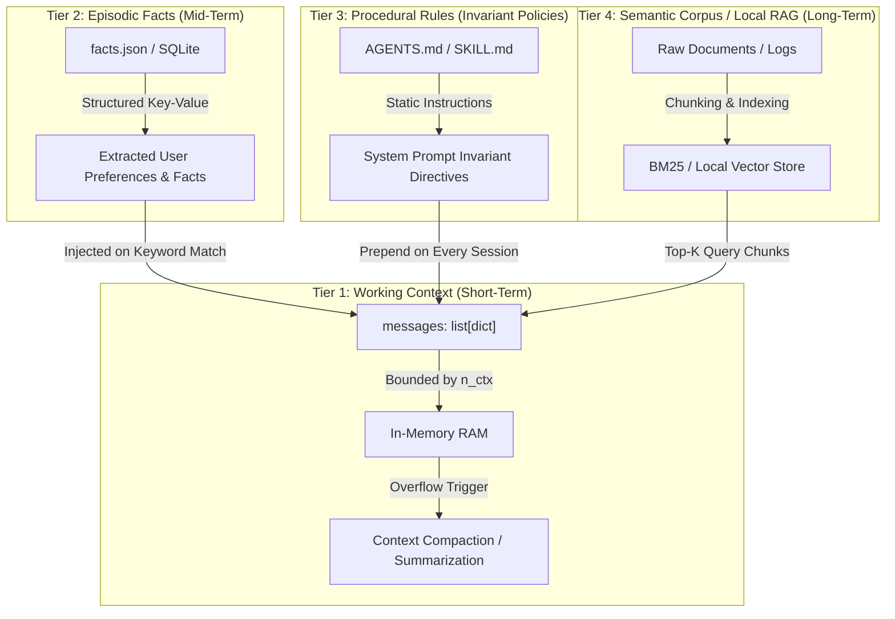

# Memory Architectures: How Agents Store and Retrieve Information

Because language models are stateless by default, an AI model has no built-in memory across individual HTTP requests. Every time you ask a question, the model only sees the text passed in that specific request payload.

What we call "agent memory" is actually a collection of standard software patterns: saving data to files or databases and feeding relevant snippets back into the model's prompt when needed.

To organize memory cleanly, we use a **4-Tier Memory Hierarchy**.

---

## 1. The 4-Tier Memory Hierarchy



### Tier 1: Working Context (Short-Term Memory)
- **Physical Form**: In-memory `messages: list[dict]` array in the running Python process.
- **Capacity**: Constrained by the model's maximum context length (`n_ctx`, e.g., 4,096 to 32,768 tokens).
- **Lifecycle**: Volatile; cleared when the process exits or when a session is explicitly reset.
- **Compaction Strategy**: Truncation, sliding window eviction, tool result summarization, and LLM-driven recursive compaction.

### Tier 2: Episodic Facts (Mid-Term Memory)
- **Physical Form**: On-disk structured files (`facts.json`, `state_store/{session_id}.json`, or SQLite tables).
- **Capacity**: Thousands of structured key-value entity records.
- **Lifecycle**: Persistent across process restarts and distinct user sessions.
- **Mechanism**: The agent emits a tool call (e.g., `save_fact(category, key, value)`) during conversation. On subsequent runs, relevant facts are loaded and formatted into system prompt context slices.

### Tier 3: Procedural Rules (Invariant Policies)
- **Physical Form**: Plaintext markdown files (`AGENTS.md`, `SKILL.md`, `rules/`).
- **Capacity**: Hundreds of lines of behavioral specifications, protocol rules, and safety boundaries.
- **Lifecycle**: Static codebase assets maintained by engineers.
- **Mechanism**: Read from disk at startup and injected at index 0 (`role: system`) of the context array.

### Tier 4: Semantic Corpus / Local RAG (Long-Term Unstructured Memory)
- **Physical Form**: Document chunk stores indexed via BM25 lexical inverted index or local embedding vectors (e.g., sqlite-vec, ChromaDB, or flat numpy cosine similarity arrays).
- **Capacity**: Gigabytes of technical manuals, code repositories, or log archives.
- **Lifecycle**: Persistent external knowledge base.
- **Mechanism**: Incoming user query is matched against the index; the top $k$ relevant chunks are retrieved and prepended to the user turn.

---

## 2. Data Contracts

### A. Fact Store Contract (`facts.json`)
The structured format used for persistent episodic facts:

```json
{
  "$schema": "http://json-schema.org/draft-07/schema#",
  "title": "FactStore",
  "type": "object",
  "required": ["version", "updated_at", "facts"],
  "properties": {
    "version": {"type": "string"},
    "updated_at": {"type": "string", "format": "date-time"},
    "facts": {
      "type": "array",
      "items": {
        "type": "object",
        "required": ["fact_id", "category", "subject", "predicate", "object", "confidence", "created_at"],
        "properties": {
          "fact_id": {"type": "string"},
          "category": {
            "type": "string",
            "enum": ["user_preference", "system_environment", "domain_fact", "incident_history"]
          },
          "subject": {"type": "string"},
          "predicate": {"type": "string"},
          "object": {"type": "string"},
          "confidence": {"type": "number", "minimum": 0.0, "maximum": 1.0},
          "source_session": {"type": "string"},
          "created_at": {"type": "string", "format": "date-time"},
          "last_accessed_at": {"type": "string", "format": "date-time"}
        }
      }
    }
  }
}
```

### B. RAG Query & Retrieval Contract (`rag_contracts.json`)
The wire schemas for semantic/lexical knowledge retrieval:

```json
{
  "query_request": {
    "query": "What is the timeout configuration for database replica connections?",
    "top_k": 3,
    "min_score": 0.75,
    "filter_category": "database_docs"
  },
  "retrieval_response": {
    "query": "What is the timeout configuration for database replica connections?",
    "matches_count": 2,
    "chunks": [
      {
        "chunk_id": "doc_db_spec_chunk_42",
        "doc_id": "database_specification.md",
        "score": 0.884,
        "text": "Replica connections must set `replica_read_timeout_ms = 3000` to prevent blocking primary sync threads.",
        "offset": 4096
      },
      {
        "chunk_id": "doc_db_spec_chunk_43",
        "doc_id": "database_specification.md",
        "score": 0.791,
        "text": "If a replica connection exceeds the read timeout, drop the pool worker immediately.",
        "offset": 4608
      }
    ]
  }
}
```

### C. Context Compaction Report (`compaction_report.json`)

```json
{
  "compaction_id": "cmp_90a1b2",
  "timestamp": "2026-08-21T10:15:00Z",
  "original_turn_count": 24,
  "compacted_turn_count": 6,
  "original_token_count": 7820,
  "compacted_token_count": 1450,
  "tokens_reclaimed": 6370,
  "compaction_strategy": "recursive_summary_with_tool_pruning",
  "summary_block": "User investigated auth server latency. Discovered high CPU on redis-cache-01 caused by runaway keys command. Cache was flushed, latency normalized to 4ms."
}
```

---

## 3. Memory Lifecycle State Machine

The progression of data through the memory lifecycle:

| Current State | Event / Trigger | Guard / Precondition | Next State | Action / Storage Mutation |
|---|---|---|---|---|
| `INGESTION` | `user_turn_received` | New prompt received | `EXTRACTION` | Tokenize text; calculate current working context token budget. |
| `EXTRACTION` | `fact_detected` | Prompt contains explicit user preferences or env facts | `STORAGE` | Model emits `save_fact` tool call with structured JSON. |
| `EXTRACTION` | `retrieval_needed` | Prompt queries external documentation / history | `RETRIEVAL` | Compute query embeddings or BM25 terms; search Tier 4 index. |
| `STORAGE` | `fact_validated` | Schema validation passes & non-duplicate | `RETRIEVAL` | Append/update row in `facts.json` on disk; update timestamp. |
| `RETRIEVAL` | `chunks_ranked` | Top-K matches score >= `min_score` | `WORKING_CONTEXT` | Format chunks into markdown block; prepend to current turn. |
| `WORKING_CONTEXT`| `context_limit_approaching` | `current_tokens > max_tokens * 0.80` | `COMPACTION` | Trigger context compaction kernel. |
| `COMPACTION` | `summary_generated` | Old turns compressed to summary paragraph | `EVICTION` | Overwrite older message range with single `role: system` summary block. |
| `EVICTION` | `stale_fact_eviction` | Fact `last_accessed_at` > TTL (e.g. 90 days) | `STORAGE` | Prune stale rows from `facts.json` during maintenance cycle. |

---

## 4. Negative Boundaries: Why 90% of Local Agents Do NOT Need Vector Databases

A common architectural error is deploying complex vector databases (Milvus, Pinecone, Qdrant) for local single-node agents. In local engineering environments:

1. **Semantic Drift & False Positives**: Vector embeddings project text into dense geometric spaces where cosine similarity frequently matches completely irrelevant passages that share grammatical structure, while missing critical exact matches.
2. **Failure on Exact Identifiers**: Vector search fails miserably on UUIDs, IP addresses, function names, error codes, and git commit hashes (`git checkout 8f9c12b` does not have a "semantic meaning").
3. **High Latency & Resource Consumption**: Local embedding models require 100ms–500ms of CPU/GPU compute per query and several gigabytes of RAM.
4. **Opaque Debugging**: You cannot `grep` a vector index. Inspecting why a vector database returned a bad chunk requires multidimensional geometric inspection.

### Superior Deterministic Alternatives
- **Structured Facts (`facts.json`)**: Exact key lookup in a Python dictionary runs in $O(1)$ time (< 0.1ms).
- **SQLite with FTS5 / BM25**: Full-text search on local SQLite tables provides millisecond keyword matching, token filtering, and exact regex matching.
- **Local `ripgrep` / Python regex**: Scanning 100,000 lines of codebase files with `rg` takes under 15ms.

### Additional Negative Boundaries
- **Memory is NOT Consciousness**: It is file serialization.
- **Summarization is Permanently Lossy**: When 20 turns are compressed into a 1-paragraph summary, nuanced details (exact error strings, line numbers) are permanently destroyed and cannot be retrieved by the model.
- **System Prompts are NOT Free**: Every token in `AGENTS.md` or `SKILL.md` is charged against the context budget on **every single turn**.

---

## 5. Concrete Step Walkthrough: Preference Extraction, Persistence, and Multi-Session Retrieval

### The Scenario
A user sets a preference in Session 1. In Session 2 (a fresh process invocation), the agent loads and respects the preference without the user re-stating it.

```
[SESSION 1: EXTRACTION & STORAGE]
1. User prompt arrives:
   "From now on, always format database migrations using standard PostgreSQL syntax and indent with 2 spaces."
2. Agent evaluates prompt. Detects user preference constraint.
3. Agent invokes tool:
   save_fact(
     category="user_preference",
     subject="database_migration",
     predicate="syntax_and_indentation",
     object="PostgreSQL syntax with 2-space indentation"
   )
4. Host executes save_fact:
   - Reads state_store/facts.json.
   - Appends new fact object with fact_id="fact_pref_001", created_at="2026-08-21T10:00:00Z".
   - Writes state_store/facts.json to disk.
5. Agent responds: "Preference recorded: migrations will use PostgreSQL syntax with 2-space indentation."
6. Session 1 terminates. Process exits.

[SESSION 2: FRESH PROCESS STARTUP & RETRIEVAL]
7. A new process starts. Host loads agent_config.json.
8. Host reads state_store/facts.json from disk.
9. Host constructs initial system prompt with active user facts:
   [ACTIVE USER PREFERENCES]
   - database_migration: PostgreSQL syntax with 2-space indentation
10. User prompt arrives:
    "Write a migration script to add a 'status' enum column to the 'orders' table."
11. Model receives prompt with injected preference in system context.
12. Model generates migration script adhering to PostgreSQL syntax with exact 2-space indent:
    CREATE TYPE order_status AS ENUM ('pending', 'processing', 'completed', 'cancelled');
    ALTER TABLE orders
      ADD COLUMN status order_status DEFAULT 'pending';
13. Output delivered accurately without requiring prompt repetition.

[SESSION 2: FACT UPDATE / CONFLICT RESOLUTION]
14. User says: "Update our migration style: change indentation to 4 spaces."
15. Agent invokes update_fact(fact_id="fact_pref_001", new_object="PostgreSQL syntax with 4-space indentation").
16. Host updates the existing row in facts.json in-place; bumps updated_at timestamp.
```

---

## 6. Pure Standard Library Memory Manager Implementation

```python
import json
import pathlib
import time
from typing import Optional

class FactStore:
    def __init__(self, storage_path: str = "state_store/facts.json"):
        self.storage_path = pathlib.Path(storage_path)
        self.storage_path.parent.mkdir(parents=True, exist_ok=True)
        if not self.storage_path.exists():
            self._save({"version": "1.0", "updated_at": "", "facts": []})

    def _load(self) -> dict:
        return json.loads(self.storage_path.read_text(encoding="utf-8"))

    def _save(self, data: dict):
        data["updated_at"] = time.strftime("%Y-%m-%dT%H:%M:%SZ", time.gmtime())
        self.storage_path.write_text(json.dumps(data, indent=2), encoding="utf-8")

    def save_fact(self, category: str, subject: str, predicate: str, obj: str) -> str:
        data = self._load()
        # Check if subject + predicate already exists (in-place update)
        for fact in data["facts"]:
            if fact["category"] == category and fact["subject"] == subject and fact["predicate"] == predicate:
                fact["object"] = obj
                fact["last_accessed_at"] = time.strftime("%Y-%m-%dT%H:%M:%SZ", time.gmtime())
                self._save(data)
                return fact["fact_id"]
                
        fact_id = f"fact_{int(time.time()*1000)}"
        new_fact = {
            "fact_id": fact_id,
            "category": category,
            "subject": subject,
            "predicate": predicate,
            "object": obj,
            "confidence": 1.0,
            "created_at": time.strftime("%Y-%m-%dT%H:%M:%SZ", time.gmtime()),
            "last_accessed_at": time.strftime("%Y-%m-%dT%H:%M:%SZ", time.gmtime())
        }
        data["facts"].append(new_fact)
        self._save(data)
        return fact_id

    def get_facts_context_block(self, category: Optional[str] = None) -> str:
        data = self._load()
        lines = ["[STORED KNOWLEDGE & PREFERENCES]"]
        for f in data["facts"]:
            if category is None or f["category"] == category:
                lines.append(f"- {f['subject']} ({f['predicate']}): {f['object']}")
        return "\n".join(lines) if len(lines) > 1 else ""
```

---

## Related Course Modules

- [02_the_contract](../../education/02_the_contract/00_messages_and_json.md): Message schemas and context lists.
- [07_the_state](../../education/07_the_state/00_save_the_messages.md): Session persistence to disk.
- [08_context_compaction](../../education/08_context_compaction/00_context_compaction.md): Context window sliding and compaction algorithms.
- [09_agentic_memory_and_rag](../../education/09_agentic_memory_and_rag/01_agentic_memory.md): Episodic memory vs local RAG search.
- [13_one_agent](../../education/13_one_agent/00_persona_tools_loop_state.md): Integrated agent state and memory.

