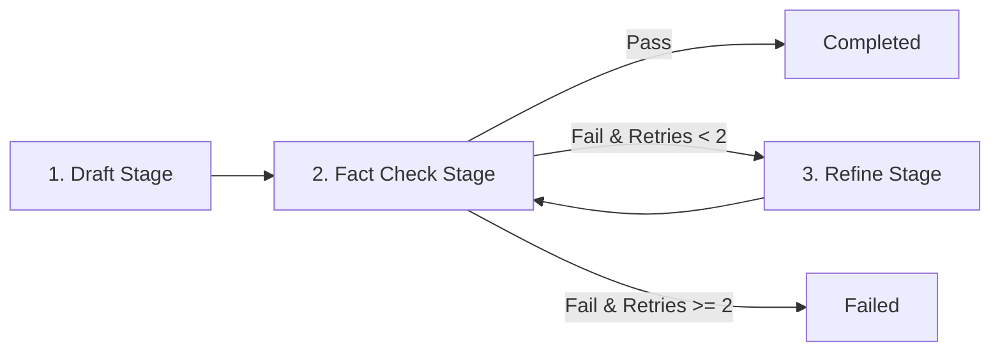

# Framework Translations to Pure Python (Rosetta Stone)

Modern AI agent frameworks (LangChain, LangGraph, CrewAI, AutoGen) introduce thousands of classes, complex inheritance trees, and proprietary DSLs. However, every single agent framework decomposes into the exact same standard Python primitives:

1. **HTTP Requests**: `urllib.request` / `http.client` issuing `POST /v1/chat/completions`
2. **Data Serialization**: `json.loads()` and `json.dumps()`
3. **Control Loops**: `while` loops managing turn budgets and condition checks
4. **Tool Registries**: `dict[str, Callable]` mapping strings to functions
5. **State Storage**: `dict` or `list` serialized to `.json` files on disk

This document is a technical **Rosetta Stone** mapping framework abstractions directly to standard library Python implementations.

---

## 1. The Comprehensive Translation Matrix (Rosetta Stone)

| Framework Class / Abstraction | What the Framework Claims It Does | Underlying Pure Python Primitive | Native Data Structure / Shape | Course Chapter & Lab |
|---|---|---|---|---|
| **LangChain** `ChatPromptTemplate` | Manages dynamic prompt templates with variable injection | String interpolation / `str.format()` or f-strings | `f"Goal: {goal}"` | [02_the_contract](../../education/02_the_contract/lab1_structured_json.md) |
| **LangChain** `@tool` / `StructuredTool` | Wraps functions with Pydantic schemas for LLM tool binding | Dict JSON schema + standard Python function | `TOOLS_SCHEMA` dict + `TOOL_REGISTRY` | [03_the_dispatcher](../../education/03_the_dispatcher/lab1_tool_dispatch.md) |
| **LangChain** `AgentExecutor` | Executes the autonomous ReAct tool loop | Bounded `while` loop with `tool_calls` parsing | `while turns < max_turns:` | [04_the_loop](../../education/04_the_loop/lab1_react_loop.md) |
| **LangChain** `ConversationBufferMemory` | Retains conversational history across turns | Append-only `list[dict]` in RAM | `messages.append({"role": ...})` | [02_the_contract](../../education/02_the_contract/00_messages_and_json.md) |
| **LangChain** `ConversationSummaryBufferMemory` | Compresses older conversation turns into a summary | Summarization prompt replacing index range `1:k` | `messages = [sys, summary] + recent` | [08_context_compaction](../../education/08_context_compaction/lab1_context_window.md) |
| **CrewAI** `Agent` | Represents an autonomous role-playing entity | System prompt string + tool registry dict | `{"role": "system", "content": "..."}` | [13_one_agent](../../education/13_one_agent/lab1_core_harness_kernel.md) |
| **CrewAI** `Task` | Defines an objective with expected output format | Standard dict with prompt instructions & schema | `{"task_id": "...", "instruction": "..."}` | [10_the_workflow](../../education/10_the_workflow/lab1_dag_pipeline.md) |
| **CrewAI** `Crew(process=Process.sequential)` | Executes tasks sequentially across agents | `for task in tasks:` pipeline loop | `for t in task_list: run_agent(t)` | [10_the_workflow](../../education/10_the_workflow/lab1_dag_pipeline.md) |
| **CrewAI** `Crew(process=Process.hierarchical)` | Supervisor delegates subtasks to worker agents | Supervisor turn loop emitting Handoff JSON | `supervisor_dispatch(handoff_dict)` | [14_two_agents](../../education/14_two_agents/lab1_supervisor_worker.md) |
| **AutoGen** `ConversableAgent` | Peer agent capable of sending and receiving messages | Agent loop function reading/writing session files | `run_agent(messages) -> response_dict` | [14_two_agents](../../education/14_two_agents/lab2_agent_handoff.md) |
| **AutoGen** `GroupChat` | Multi-agent group discussion channel | Shared `messages: list[dict]` with turn router | `router(messages) -> next_agent_id` | [14_two_agents](../../education/14_two_agents/00_topologies.md) |
| **AutoGen** `GroupChatManager` | Orchestrates speaking order in multi-agent chat | Conditional `while` loop evaluating speaker select | `while not done: speaker = select()` | [14_two_agents](../../education/14_two_agents/lab1_supervisor_worker.md) |
| **LangGraph** `StateGraph` | Directed graph workflow with typed state dictionary | Finite State Machine dictionary mapping state to fn | `TRANSITIONS = {"STATE_A": fn_a}` | [10_the_workflow](../../education/10_the_workflow/lab2_graph_workflow.md) |
| **LangGraph** `add_node(name, func)` | Registers a state transition execution node | Python dictionary mapping string key to function | `NODES[name] = func` | [10_the_workflow](../../education/10_the_workflow/00_deterministic_dags.md) |
| **LangGraph** `add_edge(start, end)` | Defines unconditional transition between nodes | Direct return or next-state pointer in dict | `return "NEXT_STATE"` | [10_the_workflow](../../education/10_the_workflow/lab2_graph_workflow.md) |
| **LangGraph** `add_conditional_edges(node, router)` | Dynamically branches execution based on state | `if / elif / else` or function returning string | `next_node = router(current_state)` | [10_the_workflow](../../education/10_the_workflow/lab2_graph_workflow.md) |

---

## 2. Side-by-Side Code Comparisons

### Comparison 1: Tool Definition & Registry

#### Framework (LangChain)
```python
from langchain_core.tools import tool
from pydantic import BaseModel, Field

class CalculateHashInput(BaseModel):
    path: str = Field(description="Target file path")

@tool("calculate_hash", args_schema=CalculateHashInput)
def calculate_hash(path: str) -> str:
    """Calculate the MD5 hash of a file."""
    import hashlib
    with open(path, "rb") as f:
        return hashlib.md5(f.read()).hexdigest()
```

#### Pure Python Standard Library
```python
import hashlib

def calculate_hash(path: str) -> dict:
    with open(path, "rb") as f:
        return {"hash": hashlib.md5(f.read()).hexdigest()}

TOOLS_SCHEMA = [
    {
        "type": "function",
        "function": {
            "name": "calculate_hash",
            "description": "Calculate the MD5 hash of a file.",
            "parameters": {
                "type": "object",
                "properties": {"path": {"type": "string", "description": "Target file path"}},
                "required": ["path"]
            }
        }
    }
]

TOOL_REGISTRY = {"calculate_hash": calculate_hash}
```

---

### Comparison 2: The ReAct Execution Loop

#### Framework (LangChain)
```python
from langchain.agents import AgentExecutor, create_tool_calling_agent
from langchain_core.prompts import ChatPromptTemplate
from langchain_openai import ChatOpenAI

prompt = ChatPromptTemplate.from_messages([
    ("system", "You are a file utility agent."),
    ("human", "{input}"),
    ("placeholder", "{agent_scratchpad}"),
])
model = ChatOpenAI(model="gpt-4o-mini", temperature=0)
agent = create_tool_calling_agent(model, [calculate_hash], prompt)
executor = AgentExecutor(agent=agent, tools=[calculate_hash], verbose=True)
result = executor.invoke({"input": "Check hash of notes.txt"})
```

#### Pure Python Standard Library
```python
import json, urllib.request

def run_react_agent(user_input: str, max_turns: int = 5) -> str:
    messages = [
        {"role": "system", "content": "You are a file utility agent."},
        {"role": "user", "content": user_input}
    ]
    for _ in range(max_turns):
        req = urllib.request.Request(
            "http://127.0.0.1:11434/v1/chat/completions",
            data=json.dumps({"model": "llama3.2:1b", "messages": messages, "tools": TOOLS_SCHEMA}).encode("utf-8"),
            headers={"Content-Type": "application/json"}
        )
        with urllib.request.urlopen(req) as resp:
            choice = json.loads(resp.read().decode("utf-8"))["choices"][0]["message"]
        messages.append(choice)
        
        tool_calls = choice.get("tool_calls")
        if not tool_calls:
            return choice.get("content", "")
            
        for call in tool_calls:
            fn = TOOL_REGISTRY[call["function"]["name"]]
            args = json.loads(call["function"]["arguments"])
            res = fn(**args)
            messages.append({"role": "tool", "tool_call_id": call["id"], "content": json.dumps(res)})
            
    raise RuntimeError("Exceeded turn budget")
```

---

### Comparison 3: State Graph Workflows

#### Framework (LangGraph)
```python
from typing import TypedDict
from langgraph.graph import StateGraph, END

class ResearchState(TypedDict):
    query: str
    notes: str
    approved: bool

def research_node(state: ResearchState) -> ResearchState:
    state["notes"] = f"Findings for {state['query']}"
    return state

def review_node(state: ResearchState) -> ResearchState:
    state["approved"] = len(state["notes"]) > 10
    return state

def should_continue(state: ResearchState) -> str:
    return END if state["approved"] else "research"

graph = StateGraph(ResearchState)
graph.add_node("research", research_node)
graph.add_node("review", review_node)
graph.set_entry_point("research")
graph.add_edge("research", "review")
graph.add_conditional_edges("review", should_continue)
app = graph.compile()
final_state = app.invoke({"query": "AI Agents", "notes": "", "approved": False})
```

#### Pure Python Standard Library
```python
def run_research_workflow(query: str) -> dict:
    state = {"query": query, "notes": "", "approved": False}
    current_node = "research"
    
    while current_node != "END":
        if current_node == "research":
            state["notes"] = f"Findings for {state['query']}"
            current_node = "review"
        elif current_node == "review":
            state["approved"] = len(state["notes"]) > 10
            current_node = "END" if state["approved"] else "research"
            
    return state
```

---

## 3. Negative Boundaries: The Hidden Costs of Framework Wrappers

1. **Token Cost Multiplication**: Many frameworks secretly inject 1,000+ tokens of hidden system prompt scaffolding, schema formatting instructions, and retry wrappers on every API call.
2. **Impenetrable Call Stacks**: When an HTTP request fails in a framework, the traceback often spans 35 stack frames deep across 8 abstraction layers (`LangChainCore -> RunnableSequence -> DynamicToolHandler -> LangGraphRunner`). In stdlib Python, the traceback is exactly 2 lines (`urllib.request.urlopen`).
3. **Silent Truncation & State Corruption**: Framework memory managers frequently prune messages using opaque internal heuristics, causing silent context loss without error warnings.
4. **Dependency Lock-In**: Frameworks introduce hundreds of transitive dependencies, leading to version conflicts and security vulnerabilities in enterprise production environments.

---

## 4. Concrete Step Walkthrough: Converting a 3-Node LangGraph Pipeline to Pure Python

### The Goal
Build a 3-stage content creation pipeline:
1. `draft_stage`: Generates an initial draft.
2. `fact_check_stage`: Checks draft for unverifiable claims.
3. `refine_stage`: If fact-check fails, rewrites the draft (maximum 2 retries).



### Complete Standalone Implementation (Pure Stdlib Python)

```python
import json
import urllib.request

def llm_complete(prompt: str, model: str = "llama3.2:1b") -> str:
    req = urllib.request.Request(
        "http://127.0.0.1:11434/v1/chat/completions",
        data=json.dumps({
            "model": model,
            "messages": [{"role": "user", "content": prompt}],
            "temperature": 0.0
        }).encode("utf-8"),
        headers={"Content-Type": "application/json"}
    )
    with urllib.request.urlopen(req) as resp:
        return json.loads(resp.read().decode("utf-8"))["choices"][0]["message"]["content"]

def execute_pipeline(topic: str, max_retries: int = 2) -> dict:
    state = {
        "topic": topic,
        "draft": "",
        "critique": "",
        "is_valid": False,
        "attempts": 0,
        "status": "in_progress"
    }
    
    # 1. Draft Stage
    state["draft"] = llm_complete(f"Write a concise technical summary about: {state['topic']}")
    state["attempts"] = 1
    
    # State Machine Loop
    while state["status"] == "in_progress":
        # 2. Fact Check Stage
        eval_prompt = (
            f"Review this summary for technical inaccuracies:\n{state['draft']}\n"
            "Output JSON: {\"is_valid\": true|false, \"critique\": \"...\"}"
        )
        eval_res = json.loads(llm_complete(eval_prompt))
        state["is_valid"] = eval_res.get("is_valid", False)
        state["critique"] = eval_res.get("critique", "")
        
        if state["is_valid"]:
            state["status"] = "success"
            break
            
        if state["attempts"] > max_retries:
            state["status"] = "failed_exhausted_retries"
            break
            
        # 3. Refine Stage
        refine_prompt = (
            f"Original Draft:\n{state['draft']}\n"
            f"Critique:\n{state['critique']}\n"
            "Rewrite the summary correcting the issues cited."
        )
        state["draft"] = llm_complete(refine_prompt)
        state["attempts"] += 1
        
    return state
```

---

## 5. Architectural Takeaway

Frameworks do not provide machine intelligence; **foundation models and system prompts do**.

Every feature provided by an agent library can be written in fewer lines of pure standard library Python, yielding:
- 10x faster startup times
- Zero external pip dependency risks
- Complete transparency over context window tokens
- Deterministic, easily testable software components

---

## Related Course Modules

- [03_the_dispatcher](../../education/03_the_dispatcher/00_tool_dispatch.md): Tool dispatch mechanics.
- [04_the_loop](../../education/04_the_loop/00_the_react_loop.md): The ReAct loop in stdlib Python.
- [06_the_reliability](../../education/06_the_reliability/00_cot_and_reasoning.md): Error handling, cycle detection, and resilient gateway routing.
- [10_the_workflow](../../education/10_the_workflow/00_deterministic_dags.md): DAG and graph routing without framework dependencies.
- [13_one_agent](../../education/13_one_agent/00_persona_tools_loop_state.md): Unified single-agent class kernel.
- [14_two_agents](../../education/14_two_agents/00_topologies.md): Multi-agent orchestration.

